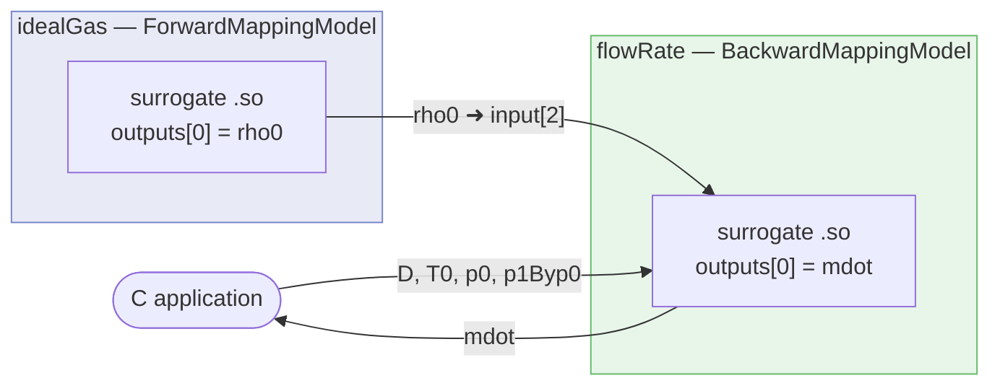
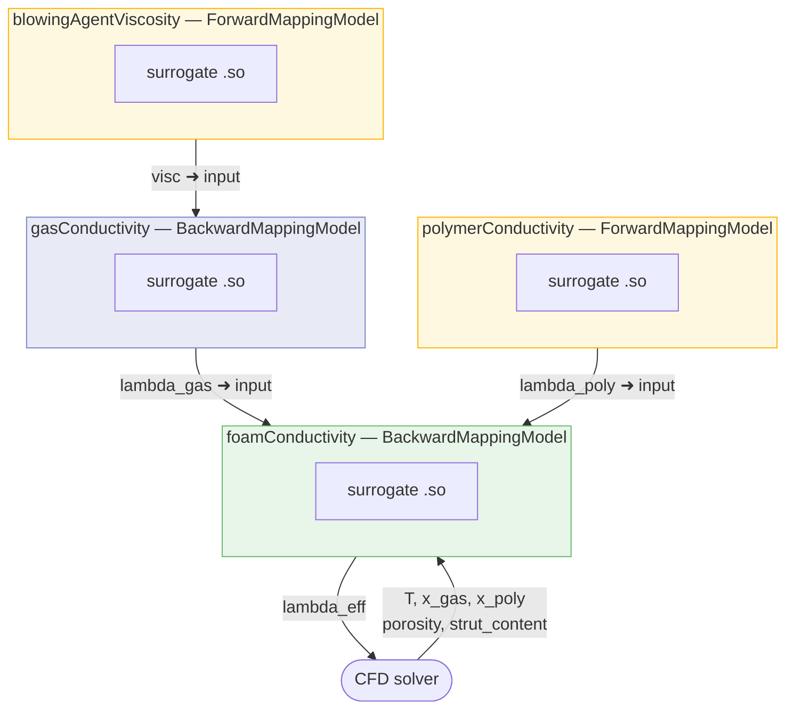
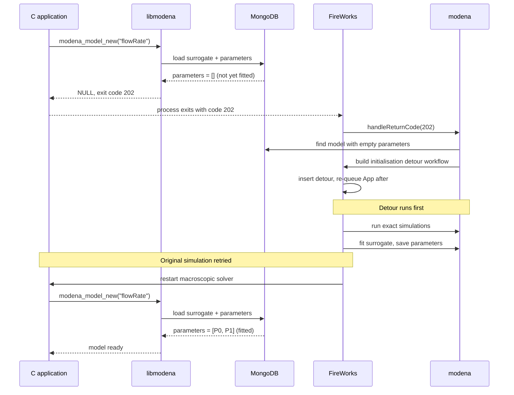

# MoDeNa 2.0 {#mainpage}

**Mo**delling of morphology **De**velopment of micro- and **Na**nostructures —
an open-source multi-scale modelling framework.

> **MoDeNa 2.0 is not backwards compatible with MoDeNa 1.x.**
> The Python library, C API, MongoDB schema, and workflow interfaces have all
> changed.  Models and databases from version 1.x cannot be used without
> migration.  Python 2 is not supported; **Python 3.10 or later is required.**

MoDeNa lets macroscopic simulation codes (CFD solvers, process simulators,
Python scripts) call expensive sub-models at runtime through cheap surrogate
approximations.  When the surrogate is queried outside its trained region,
MoDeNa automatically runs new exact simulations, refits the surrogate, and
restarts the caller — all without any application-side code changes.

---

## How it works

```
┌─────────────────────────────────────────────────────────┐
│  Macroscopic solver  (C, C++, Fortran, MATLAB, Python)  │
│                                                         │
│   modena_model_call() ──► surrogate .so  ◄── fast       │
│          │                                              │
│          │ out of bounds?                               │
│          ▼                                              │
│     exit code 200 ──► FireWorks ──► exact simulation    │
│                                 ──► parameter fitting   │
│                                 ──► restart solver      │
└─────────────────────────────────────────────────────────┘
```

1. The surrogate is a compiled C shared library evaluated in microseconds.
2. MongoDB stores the surrogate parameters, training data, and workflow state.
3. [FireWorks](https://materialsproject.github.io/fireworks/) orchestrates
   exact simulations and refitting, locally or on an HPC cluster.
4. `libmodena` (C) handles the runtime boundary check and exit-code signalling.
5. The Python library (`modena`) manages model registration, fitting strategies,
   and the FireWorks launchpad.

---

## Architecture diagrams

### Substitute model dependency

A surrogate model can declare other surrogate models as *substitutes*. The
framework evaluates them automatically and wires their outputs into the outer
model's input vector — the C application only supplies the top-level inputs.



The C application queries `argPos` for `D`, `T0`, `p0`, `p1Byp0` — not for
`rho0`. The framework fills that slot silently. `modena_model_argPos_check()`
knows which positions are covered by substitutes and does not require the
application to declare them.

---

### Multi-level dependency graph

Substitute models can themselves have substitutes. MoDeNa traverses the full
DAG at model-load time and evaluates sub-models bottom-up before each call to
the outer surrogate.



Yellow = `ForwardMappingModel` (exact formula, fixed parameters).
Blue = `BackwardMappingModel` (trained surrogate, adaptive).

---

### The backward-mapping loop

At runtime, the surrogate is evaluated in microseconds. When a query falls
outside the trained region, the application exits, FireWorks runs new exact
simulations, the surrogate is refitted, and the application is restarted —
automatically, without any application-side changes.

```mermaid
flowchart TD
    s([Macroscopic solver starts])
    load["modena_model_new()\nLoad surrogate + parameters\nfrom MongoDB"]
    step["Next time step"]
    call["modena_model_call()\nEvaluate compiled surrogate .so"]
    check{Input within\ntrained bounds?}
    use["Use output value\nAdvance simulation"]
    finish([Simulation complete])

    oob["Return code 200 — exit process"]
    fw["FireWorks detects exit code 200"]
    exact["Run exact simulation\nseconds to hours"]
    refit["Refit surrogate to\nexpanded dataset"]
    requeue["Re-queue macroscopic solver"]

    s --> load --> step --> call --> check
    check -- Yes --> use --> step
    use -- t ge t_end --> finish
    check -- No, out of bounds --> oob --> fw --> exact --> refit --> requeue --> load

    style exact   fill:#fff3e0,stroke:#ef6c00
    style refit   fill:#fff3e0,stroke:#ef6c00
    style call    fill:#e8f5e9,stroke:#388e3c
    style finish  fill:#e8f5e9,stroke:#388e3c
```

---

### Auto-initialisation — the 202 protocol

Running `./workflow` before `./initModels` is valid. When a model has no
fitted parameters yet, `libmodena` returns exit code 202. FireWorks intercepts
this, builds an initialisation detour workflow on the fly, runs it (collecting
training data and fitting the surrogate), then retries the original simulation.



---

## Requirements

### System

| Dependency | Version | Notes |
|---|---|---|
| CMake | ≥ 3.14 | Build system |
| C compiler | C11 | gcc or clang |
| Python | ≥ 3.10 (Python 3 only) | Interpreter and library |
| MongoDB | ≥ 5.0 | Running instance; URI in `MODENA_URI` |

### Python packages (installed automatically via pip)

| Package | Purpose |
|---|---|
| `fireworks` | Workflow engine |
| `mongoengine` | MongoDB ODM for surrogate model documents |
| `pymongo` | MongoDB driver |
| `scipy` | Latin hypercube sampling, least-squares fitting |
| `jinja2` | C code template rendering |
| `tomllib` / `tomli` | Config file parsing (`tomllib` is stdlib ≥ Python 3.11) |

### Optional

| Option | CMake flag | Requires |
|---|---|---|
| Fortran wrapper | `WITH_R=ON` via `fmodena` | gfortran |
| Julia wrapper | `-DWITH_JULIA=ON` | Julia + lld |
| MATLAB/Octave wrapper | `-DWITH_MATLAB=ON` | Octave or MATLAB |
| R wrapper | `-DWITH_R=ON` | R interpreter |
| SWIG Python bindings | `-DWITH_PYTHON_SWIG=ON` | SWIG |
| Web portal | `-DMODENA_BUILD_PORTAL=ON` | `dash`, `dash-bootstrap-components`, `plotly` (installed automatically) |
| Test suite | `-DMODENA_BUILD_TESTS=ON` | pytest |
| Doxygen docs | `-DMODENA_BUILD_DOCS=ON` | doxygen |

---

## Installation

### 1 — Install system dependencies (Ubuntu/Debian)

```bash
sudo apt install build-essential cmake python3-dev python3-pip mongodb
```

Start MongoDB:

```bash
sudo systemctl start mongod
```

### 2 — Install Python dependencies

```bash
pip install fireworks mongoengine pymongo scipy jinja2 tomli
```

`tomli` is only needed on Python < 3.11; skip it on Python 3.11+.

### 3 — Build and install MoDeNa

```bash
cmake -B build -DCMAKE_INSTALL_PREFIX="$HOME" .
cmake --build build
cmake --build build --target install
```

The `install` script at the project root is a convenience wrapper that also
enables all optional wrappers and the test suite:

```bash
./install      # builds to $HOME, runs from the project root
```

### 4 — Configure the environment

```bash
export MODENA_URI=mongodb://localhost:27017/modena
export PATH="$HOME/bin:$PATH"
export LD_LIBRARY_PATH="$HOME/lib:$LD_LIBRARY_PATH"
```

Add these to `~/.bashrc` or `~/.profile` to make them permanent.

### 5 — Verify the installation

```bash
modena doctor
```

This checks `libmodena.so`, MongoDB connectivity, all required Python packages,
and key environment variables.  All required items should show `✓`.

---

## Quick start

```bash
modena quickstart
```

For a full walkthrough see [`docs/quick-start-developer.md`](docs/quick-start-developer.md).

### Run an example

```bash
cd examples/twoTanksPython
./buildModels          # compile and install the flowRate model package
./initModels           # collect training data, fit the surrogate
./workflow             # run the simulation (backward-mapping loop)
modena fw status       # inspect the completed workflow
```

### Inspect results from Python

```python
import modena

lp = modena.lpad()
lp.status()                       # table of all Fireworks and their states
lp.retrace_to_origin(fw_id)       # print the ancestor graph for a Firework

model = modena.load('flowRate')   # load a fitted surrogate from MongoDB
```

---

## Repository layout

```
MoDeNa3/
├── CMakeLists.txt        ← single CMake entry point (run cmake from here)
├── install               ← convenience build+install script
├── src/
│   ├── src/              ← libmodena (C library: model evaluation, Python embedding)
│   ├── python/           ← modena Python package (strategies, CLI, registry)
│   ├── wrappers/         ← C++, Fortran, Julia, MATLAB, R wrappers
│   └── tests/            ← pytest + CTest suite
├── examples/
│   ├── MoDeNaModels/     ← reusable model packages (flowRate, idealGas, …)
│   ├── twoTanksPython/   ← pure-Python example (recommended starting point)
│   ├── twoTanksCxx/      ← C++ macroscopic solver example
│   ├── twoTanksFortran/  ← Fortran macroscopic solver example
│   ├── coolProp/         ← CoolProp fluid-property surrogate example
│   └── …
├── applications/         ← PUfoam and other full application packages
└── docs/                 ← user and developer guides
```

---

## Documentation

| Document | Contents |
|---|---|
| [`docs/quick-start-developer.md`](docs/quick-start-developer.md) | How to define a new model and run a workflow |
| [`docs/fireworks.md`](docs/fireworks.md) | FireWorks integration, launchpad API, CLI reference |
| [`docs/model-registry.md`](docs/model-registry.md) | `modena.toml` config, `MODENA_PATH`, lock files |
| [`docs/quick-start-c.md`](docs/quick-start-c.md) | Calling a model from C |
| [`docs/quick-start-fortran.md`](docs/quick-start-fortran.md) | Calling a model from Fortran |
| [`docs/quick-start-julia.md`](docs/quick-start-julia.md) | Calling a model from Julia |
| [`docs/quick-start-matlab.md`](docs/quick-start-matlab.md) | Calling a model from MATLAB/Octave |

Doxygen API documentation (C library + Python) can be built with:

```bash
cmake -B build -DMODENA_BUILD_DOCS=ON .
cmake --build build --target doc
```

### Web portal

The portal is a Dash web app that shows all surrogate models in the database,
their fit data and C code, and all FireWorks simulation runs.  Build and install
it with:

```bash
cmake -B build -DMODENA_BUILD_PORTAL=ON .
cmake --build build
cmake --build build --target install

export MODENA_URI=mongodb://localhost:27017/modena
modena-portal        # http://0.0.0.0:8050
```

The portal can also be run directly from the source tree without a CMake build:

```bash
export MODENA_URI=mongodb://localhost:27017/modena
cd src/portal
pip install dash dash-bootstrap-components plotly
python run.py
```

---

## Running the tests

```bash
cmake -B build -DMODENA_BUILD_TESTS=ON .
cmake --build build
ctest --test-dir build --output-on-failure
```

Python-only tests can also be run directly:

```bash
cd src/tests/python
python3 -m pytest -v
```

---

## License

GNU Lesser General Public License v3 or later.
See [`LICENSE`](LICENSE) or <https://www.gnu.org/licenses/>.

Copyright 2014–2026 MoDeNa Consortium.
