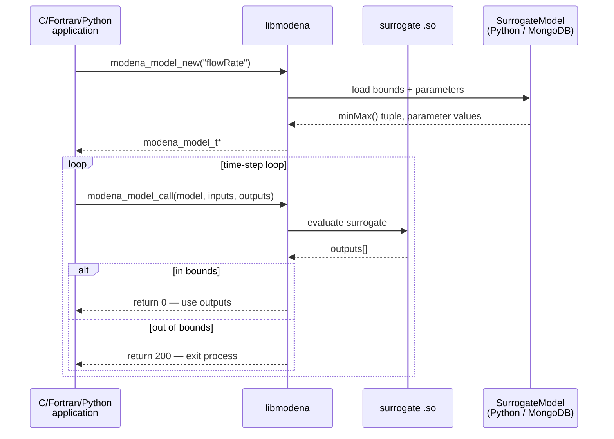
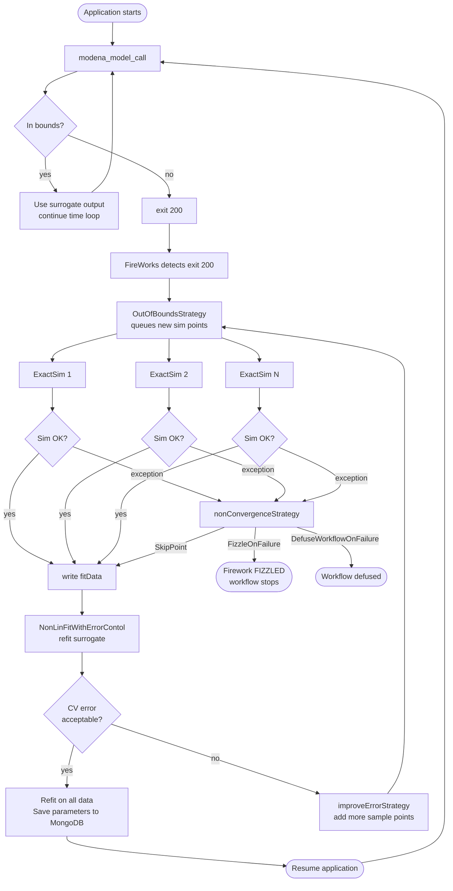
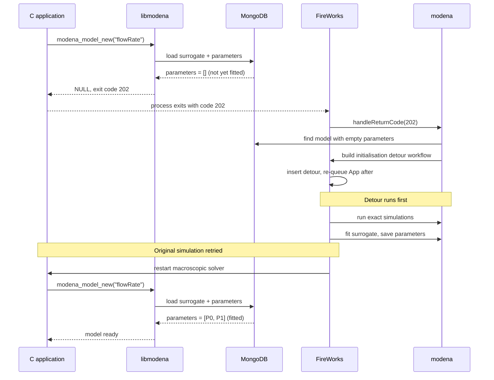
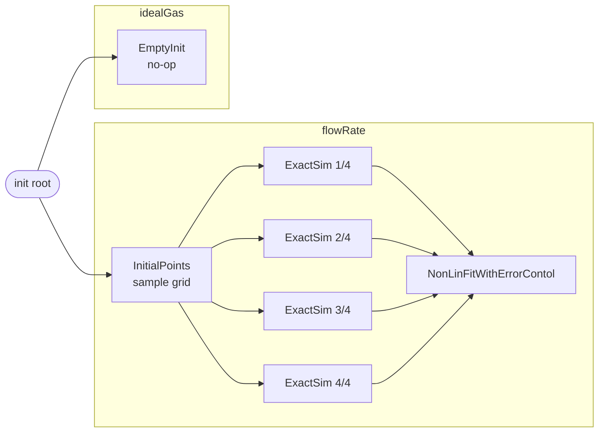
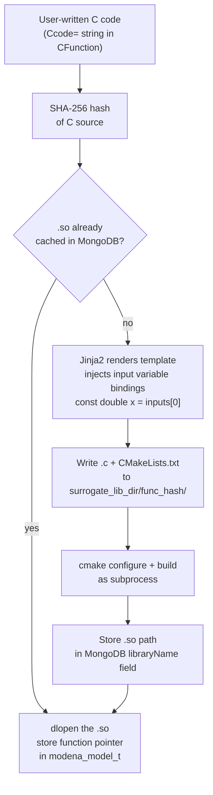
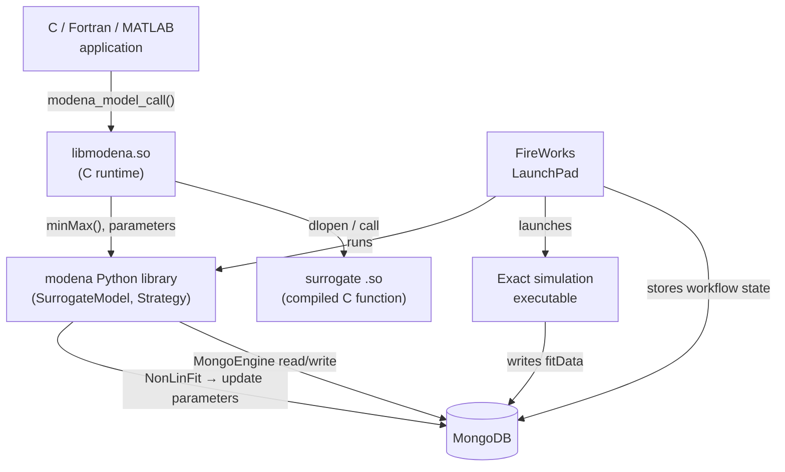

# Architecture — Models and Workflow Manager

## Overview

MoDeNa separates the **runtime call path** (fast, synchronous, in-process)
from the **training loop** (asynchronous, managed by FireWorks).

---

## Runtime call path

---

## Backward-mapping training loop

When the application exits with code 200, FireWorks takes over.  The full loop
includes three conditional branches that the simplified view omits:

---

## Auto-initialisation — the 202 protocol

If `./workflow` runs before `./initModels`, the model exists in MongoDB but
has zero fitted parameters.  libmodena detects this and returns exit code 202
instead of 200, triggering a one-time initialisation detour:

---

## Initialisation workflow

Before a simulation can run, each `BackwardMappingModel` must be seeded with
training data.  `modena.run(models)` builds this workflow automatically:

---

## CFunction compilation pipeline

The first time a model is registered (`initModels` or first import), the C
surrogate function is compiled from source and the resulting `.so` path is
cached in MongoDB.  Subsequent runs skip the compilation step entirely.

The `surrogate_lib_dir` is resolved in priority order: `MODENA_SURROGATE_LIB_DIR`
env var → `[surrogate_functions] lib_dir` in `modena.toml` → installed library
directory.  SHA-256 is used (not MD5) because MD5 has known collisions that
could silently reuse the wrong `.so` for a different function.

---

## Component relationships

---

## Key data flows

| Signal | From | To | Meaning |
|---|---|---|---|
| `return 0` | `libmodena` | application | surrogate evaluated successfully |
| `return 100` | `libmodena` | application | surrogate was just retrained — retry this time step |
| `exit(200)` | application | FireWorks | query was out of bounds — trigger OOB training loop |
| `exit(202)` | application | FireWorks | model has no parameters yet — trigger initialisation detour |
| `minMax()` tuple | Python | C (by position) | input/output bounds and parameter count — positional, do not reorder |
| `argPos` | MongoDB | C arrays | index mapping input/output names → `double[]` array positions |
