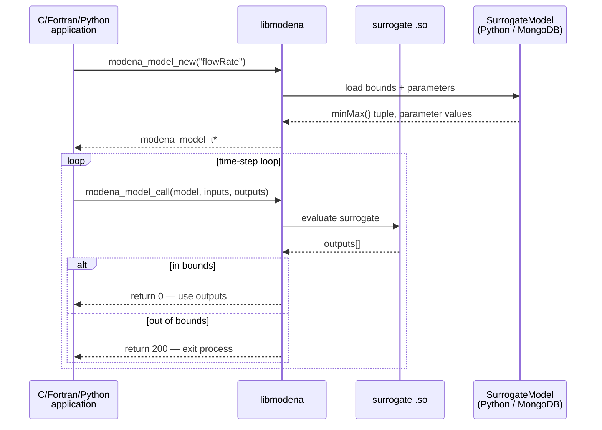
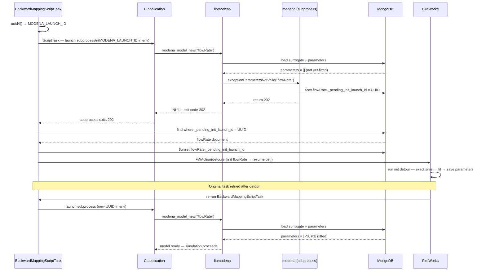
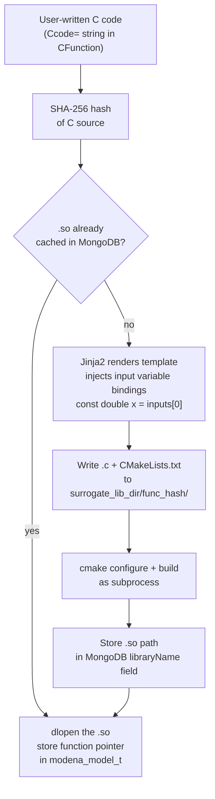
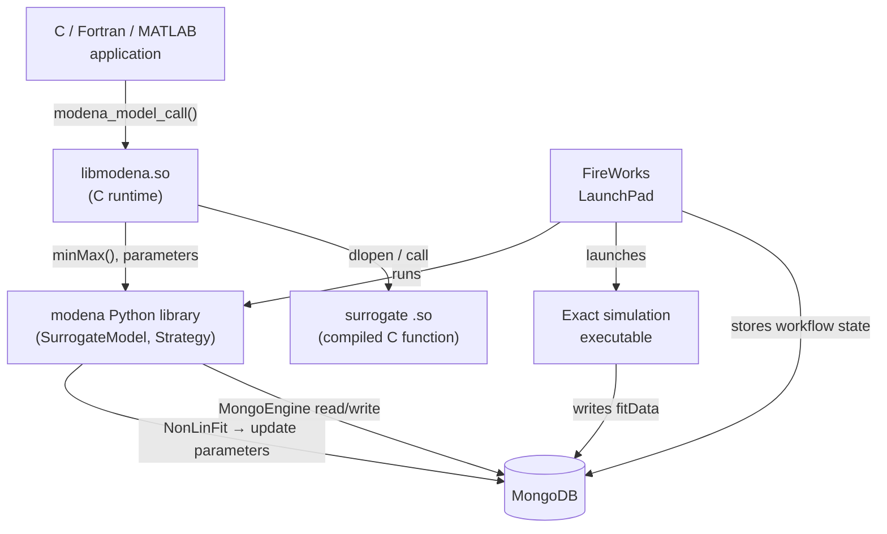

# Architecture — Models and Workflow Manager

## Overview

MoDeNa separates the **runtime call path** (fast, synchronous, in-process)
from the **training loop** (asynchronous, managed by FireWorks).

---

## Runtime call path



---

## Backward-mapping training loop

When the application exits with code 200, FireWorks takes over.  The full loop
includes three conditional branches that the simplified view omits:


---

## Auto-initialisation — the 202 protocol

If `./workflow` runs before `./initModels`, the model exists in MongoDB but
has zero fitted parameters.  libmodena detects this and returns exit code 202
instead of 200, triggering a one-time initialisation detour.

### Model identification — the UUID stamp

A naive approach — scanning MongoDB for any model with empty parameters — is
wrong: unrelated models from other projects may also be uninitialised in the
same database.  Instead, `BackwardMappingScriptTask` generates a per-launch
UUID and injects it as `MODENA_LAUNCH_ID` into the subprocess environment.
When `exceptionParametersNotValid` is called inside the subprocess via Python
embedding, it stamps that UUID onto the failing model's document.  The parent
rocket queries by UUID and initialises only that specific model.



### handleReturnCode(202) — precise path vs fallback

When `MODENA_LAUNCH_ID` is set the UUID stamp is used for precise
identification.  If the subprocess crashes before stamping (or is launched
outside `BackwardMappingScriptTask`), a fallback scan is used with a warning.

```mermaid
flowchart TD
    rc([handleReturnCode\nreturnCode = 202])
    lid{launch_id\navailable?}
    qdb[Query MongoDB:\nmodel where\n_pending_init_launch_id = UUID]
    found{model\nfound?}
    clear[Clear UUID marker\nfrom model document]
    precise([ParametersNotValid\nexact model only])
    warn[/WARNING: cannot identify\nexact model — falling back/]
    scan[Scan MongoDB:\nall models where\nparameters = \[\]]
    nomod{any\nfound?}
    term([TerminateWorkflow\ndefuse])
    fallback([ParametersNotValid\nall uninitialized models\nmay include unrelated ones])

    rc --> lid
    lid -- Yes --> qdb --> found
    found -- Yes --> clear --> precise
    found -- No  --> warn
    lid  -- No  --> warn
    warn --> scan --> nomod
    nomod -- Yes --> fallback
    nomod -- No  --> term

    style precise  fill:#388e3c,color:#fff,stroke:#2e7d32
    style fallback fill:#ef6c00,color:#fff,stroke:#e65100
    style term     fill:#c62828,color:#fff,stroke:#b71c1c
    style warn     stroke:#f57c00,stroke-width:2px
```

---

## Initialisation workflow

Before a simulation can run, each `BackwardMappingModel` must be seeded with
training data.  `modena.run(models)` builds this workflow automatically:


---

## CFunction compilation pipeline

The first time a model is registered (`initModels` or first import), the C
surrogate function is compiled from source and the resulting `.so` path is
cached in MongoDB.  Subsequent runs skip the compilation step entirely.



The `surrogate_lib_dir` is resolved in priority order: `MODENA_SURROGATE_LIB_DIR`
env var → `[surrogate_functions] lib_dir` in `modena.toml` → installed library
directory.  SHA-256 is used (not MD5) because MD5 has known collisions that
could silently reuse the wrong `.so` for a different function.

---

## Component relationships



---

## Key data flows

| Signal | From | To | Meaning |
|---|---|---|---|
| `return 0` | `libmodena` | application | surrogate evaluated successfully |
| `return 100` | `libmodena` | application | surrogate was just retrained — retry this time step |
| `exit(200)` | application | FireWorks | query was out of bounds — trigger OOB training loop |
| `exit(202)` | application | FireWorks | model has no parameters yet — trigger initialisation detour; failing model identified via `MODENA_LAUNCH_ID` UUID stamped on MongoDB document |
| `minMax()` tuple | Python | C (by position) | input/output bounds and parameter count — positional, do not reorder |
| `argPos` | MongoDB | C arrays | index mapping input/output names → `double[]` array positions |
