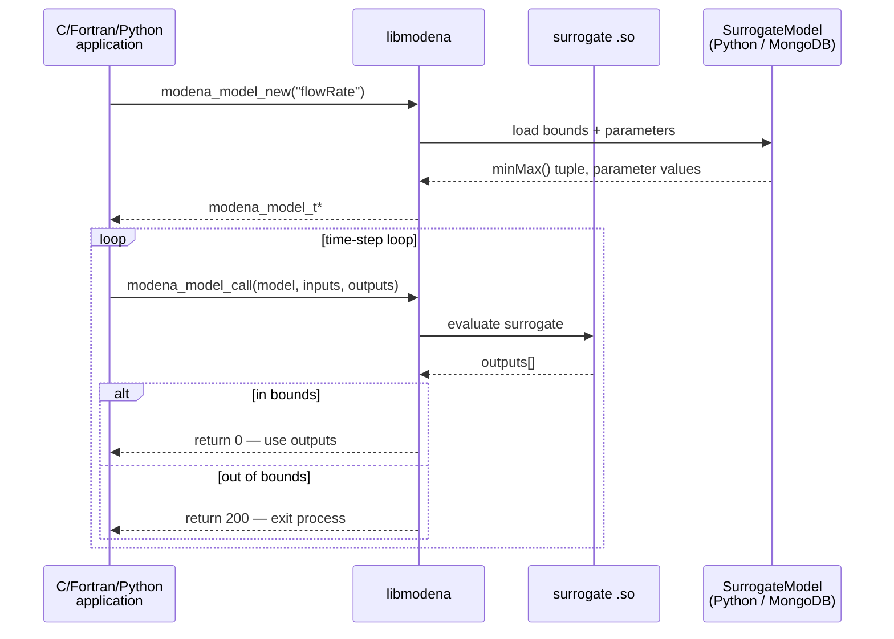
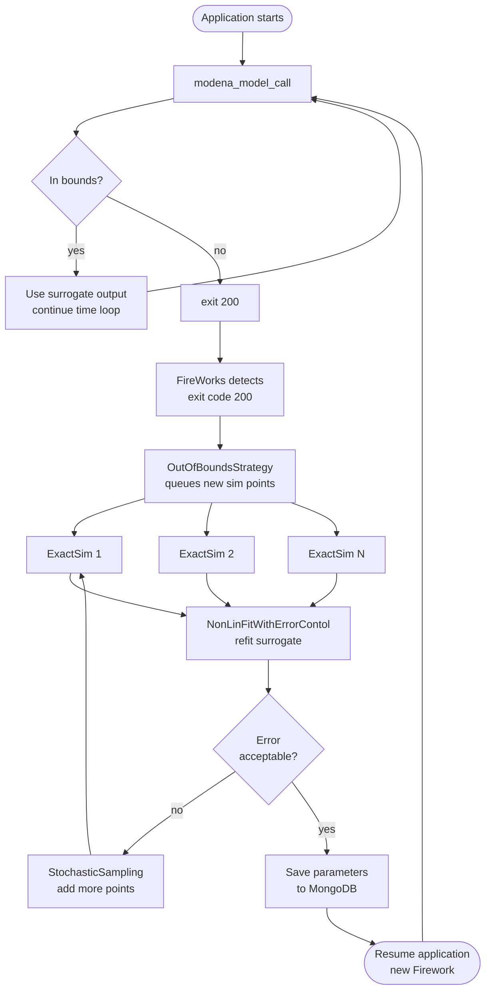
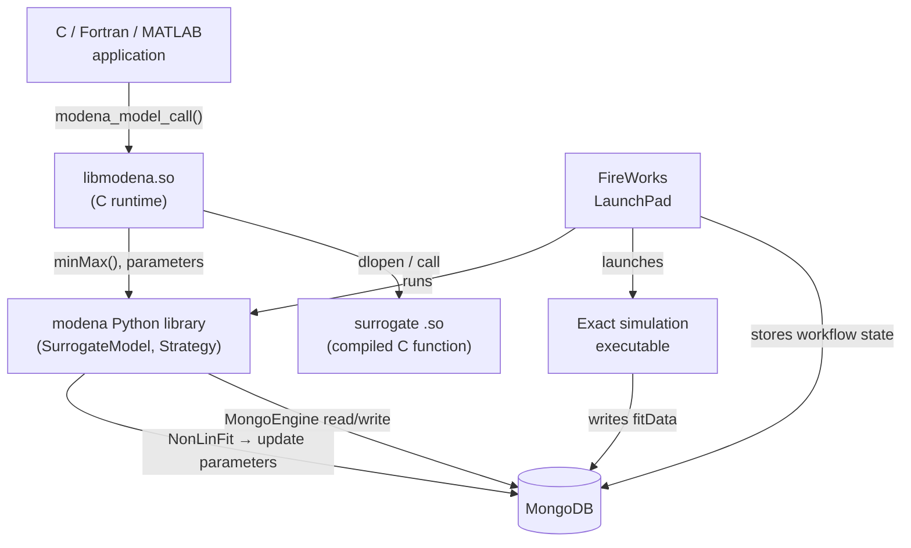

# Architecture — Models and Workflow Manager

## Overview

MoDeNa separates the **runtime call path** (fast, synchronous, in-process)
from the **training loop** (asynchronous, managed by FireWorks).

---

## Runtime call path

---

## Backward-mapping training loop

When the application exits with code 200, FireWorks takes over:

---

## Initialisation workflow

Before a simulation can run, each `BackwardMappingModel` must be seeded with
training data.  `modena.run(models)` builds this workflow automatically:

---

## Component relationships

---

## Key data flows

| Signal | From | To | Meaning |
|---|---|---|---|
| `return 0` | `libmodena` | application | surrogate evaluated successfully |
| `return 100` | `libmodena` | application | surrogate was just retrained — retry this step |
| `exit(200)` | application | FireWorks | query was out of bounds — trigger OOB loop |
| `minMax()` tuple | Python | C (by position) | input/output bounds and parameter count |
| `argPos` | MongoDB | C arrays | index mapping input/output names → array positions |
