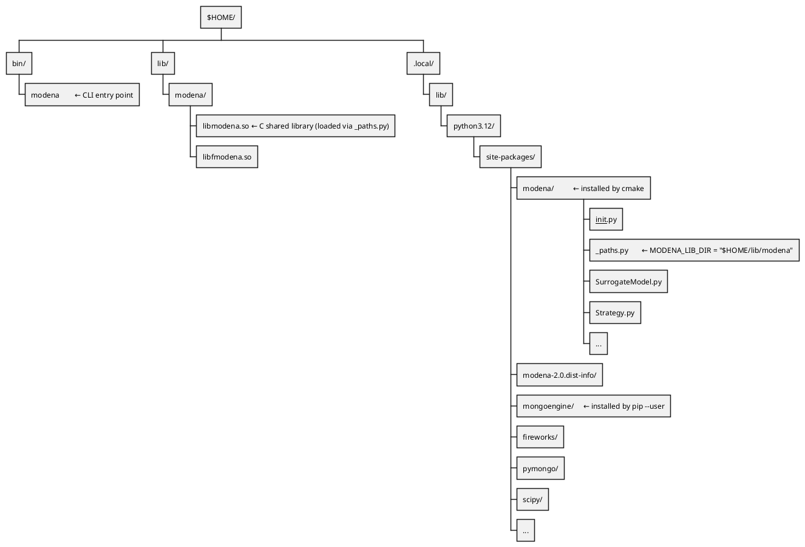

# Core Developer Guide

This guide is for developers working on the MoDeNa library itself — the C
runtime, the Python library, or a language wrapper.  For model authoring see
[quick-start-developer.md](quick-start-developer.md).

---

## Contents

1. [Architecture](#architecture)
2. [Repository layout](#repository-layout)
3. [Building](#building)
4. [The C library — libmodena](#the-c-library-libmodena)
5. [The Python library — modena](#the-python-library-modena)
6. [Cross-language boundaries](#cross-language-boundaries)
7. [Adding a language wrapper](#adding-a-language-wrapper)
8. [The surrogate compilation pipeline](#the-surrogate-compilation-pipeline)
9. [Known limitations and deferred work](#known-limitations-and-deferred-work)
10. [Platform notes](#platform-notes)

---

## Architecture

The runtime call path from a macroscopic solver to a surrogate evaluation:

```
C/Fortran/Python application
  → modena_model_call()          [libmodena — C shared library]
     → SurrogateModel.minMax()   [Python/MongoEngine — bounds + parameters]
     → compiled surrogate .so    [C shared library, generated per-function]
  ← double[] outputs
```

When an input is outside the trained bounds, `modena_model_call()` returns
exit code 200 rather than a surrogate value.  The application exits, FireWorks
detects the exit code, triggers new exact simulations and parameter fitting,
then re-queues the application.  This is the **backward-mapping loop** — the
core value proposition of the framework.

---

## Repository layout

```
MoDeNa/
├── CMakeLists.txt          ← single CMake entry point
├── src/
│   ├── src/                ← C library (libmodena)
│   │   ├── modena.h        ← public API — the only installed header
│   │   ├── model.c         ← modena_model_new/call/delete
│   │   ├── function.c      ← surrogate .so loading via lt_dlopen
│   │   ├── inputsoutputs.c ← argPos lookup, min/max arrays
│   │   ├── global.c        ← modena_initialize(), Py_Initialize()
│   │   └── inline.h        ← modena_inputs_set/get (inlined)
│   ├── python/             ← Python library (modena)
│   │   ├── SurrogateModel.py
│   │   ├── Strategy.py
│   │   ├── ErrorMetrics.py
│   │   ├── Registry.py
│   │   ├── Launchpad.py
│   │   └── Runner.py
│   ├── wrappers/
│   │   ├── cpp/            ← RAII C++ header
│   │   ├── fortran/        ← Fortran 2003 OOP wrapper
│   │   ├── julia/          ← Julia ccall wrapper
│   │   ├── matlab/mex/     ← MATLAB/Octave MEX gateway
│   │   └── r/              ← R package
│   └── tests/
│       ├── python/         ← pytest suite
│       └── c/              ← CTest executables (no Python dependency)
├── examples/               ← example model packages
├── applications/           ← PUfoam and other application packages
└── docs/                   ← user and developer guides (MkDocs)
```

---

## Building

`libmodena` embeds a Python interpreter via `Py_Initialize()` and immediately
imports `modena.SurrogateModel`.  This means the `modena` package must be on
the **system Python path** — not inside a venv — so that the embedded
interpreter can find it.  cmake owns the Python package install; pip installs
only the third-party dependencies.

```bash
# 1. Install Python dependencies to user site-packages
#    (~/.local/lib/python3.x/site-packages — found by the embedded interpreter)
pip install --user fireworks mongoengine scipy jinja2 "pydantic>=2.0"
# On Ubuntu 24.04 add --break-system-packages

# 2. Build and install using the dev preset (Debug, tests on, installs to $HOME)
cmake --preset dev
cmake --build --preset dev
cmake --install build

# 3. No PYTHONPATH needed — modena lands in ~/.local/lib/python3.x/site-packages
#    (user site-packages, found automatically by the embedded interpreter)
```

### Why not a venv?

`Py_Initialize()` in `global.c` starts the embedded interpreter without venv
awareness — it uses the compiled-in Python prefix, not `$VIRTUAL_ENV`.
Packages installed into a venv's `site-packages` are invisible to it.
`~/.local/lib/python3.x/site-packages` (user site-packages) is added by
`site.py` automatically even in embedded mode, so both `pip install --user`
deps and the cmake-installed `modena` package are found with no extra
configuration.

### Python install location and `libmodena` discovery

`src/python/CMakeLists.txt` selects `PYTHON_SITE` based on `CMAKE_INSTALL_PREFIX`:

| Prefix | `PYTHON_SITE` | `PYTHONPATH` needed? |
|---|---|---|
| `$HOME` (default) | `~/.local/lib/python3.x/site-packages` | No |
| anything else | `<prefix>/lib/python3.x/site-packages` | Yes |

`cmake --install` copies the source `.py` files plus the generated `_paths.py`
to `PYTHON_SITE/modena/`.  It also writes a minimal `.dist-info/METADATA` so
pip recognises the package as installed.

#### How the Python package locates `libmodena.so`

`PYTHON_SITE` and the C library install location (`$CMAKE_INSTALL_PREFIX/lib/modena/`)
are independent directories.  `_paths.py` is the bridge: cmake renders the
absolute library path into it at configure time, and `__init__.py` reads it at
runtime to load the shared library:

```python
# _paths.py — generated by cmake, installed alongside the .py sources
MODENA_LIB_DIR = '/home/alice/lib/modena'   # absolute, baked in at configure time

# __init__.py — import_helper() uses it
lib_path = Path(MODENA_LIB_DIR) / 'libmodena.so'
spec = importlib.util.spec_from_file_location('libmodena', lib_path)
```

This means the Python package can be anywhere on `sys.path` — the library is
always found via the absolute path in `_paths.py`, not by searching
`LD_LIBRARY_PATH`.

#### Default install layout (`CMAKE_INSTALL_PREFIX=$HOME`)



#### Custom prefix layout (`CMAKE_INSTALL_PREFIX=/opt/modena`)

```plantuml
@startwbs
* /opt/modena/
** bin/
*** modena
** lib/
*** modena/
**** libmodena.so
**** libfmodena.so
*** python3.12/
**** site-packages/
***** modena/           ← installed by cmake
****** __init__.py
****** _paths.py        ← MODENA_LIB_DIR = "/opt/modena/lib/modena"
****** SurrogateModel.py
****** ...
***** modena-2.0.dist-info/
* $HOME/
** .local/
*** lib/
**** python3.12/
***** site-packages/
****** mongoengine/     ← installed by pip --user
****** fireworks/
****** pymongo/
****** ...
@endwbs
```

For the custom prefix, the admin must add
`/opt/modena/lib/python3.12/site-packages` to `PYTHONPATH` (e.g. via a
module file) so the embedded interpreter can find the `modena` package.

**Adding a Python dependency:** add it to `install_requires` in
`src/python/setup.py.in` for documentation purposes, and also update the
`pip install --user` line in `README.md` — that is the authoritative install
step for dependencies.

### Presets

`CMakePresets.json` at the project root defines three presets:

| Preset | Prefix | Build type | Tests | Use case |
|---|---|---|---|---|
| `default` | `$HOME` | Release | off | end-user install |
| `dev` | `$HOME` | Debug | on | library development |
| `hpc` | `/opt/modena` | Release | off | system/cluster install |

```bash
cmake --preset dev           # configure
cmake --build --preset dev   # build
cmake --install build        # install
ctest --preset dev           # run tests
cmake --build build --target doc  # Doxygen (requires -DMODENA_BUILD_DOCS=ON)
```

Machine-local settings (e.g. `WITH_MATLAB=ON`, a non-standard prefix) go in
`CMakeUserPresets.json` in the project root — this file is gitignored.
Example:

```json
{
  "version": 3,
  "configurePresets": [
    {
      "name": "my-dev",
      "inherits": "dev",
      "cacheVariables": {
        "WITH_MATLAB": "ON"
      }
    }
  ]
}
```

### `src/CMakeLists.txt` dual-use

`src/CMakeLists.txt` works as a subdirectory from the project root and also
standalone (`cmake ../src`).  All local paths use `${CMAKE_CURRENT_LIST_DIR}`
— never `${CMAKE_SOURCE_DIR}`, which would break paths in subdirectory mode.

---

## The C library — libmodena

### Responsibilities

| Step | Function | File |
|---|---|---|
| Initialise Python interpreter | `modena_initialize()` | `global.c` |
| Load model from MongoDB | `modena_model_new()` | `model.c` |
| Evaluate surrogate | `modena_model_call()` | `model.c` |
| Load compiled surrogate `.so` | `CFunction.__init__` → `lt_dlopen` | `function.c` |
| Detect out-of-bounds | `modena_model_call()` | `model.c` |
| Free model | `modena_model_delete()` | `model.c` |

`modena_initialize()` **must** be called before any other `modena_` function.
It calls `Py_Initialize()`, configures `sys.path`, and loads the
`SurrogateModel` Python class into the global `modena_SurrogateModel`.

### Public API

`modena.h` is the **only** public header and defines the stable ABI.  Do not
remove or rename anything in `modena.h` without a major version bump.  Internal
headers (`model.h`, `function.h`, `inputsoutputs.h`, `inline.h`, `global.h`)
are not installed.

### Memory ownership

- `modena_model_new()` allocates `modena_model_t` and all sub-arrays on the
  heap.  `modena_model_delete()` frees everything.  Callers must call delete.
- `inputs`, `outputs`, `parameters` arrays inside `modena_model_t` are **owned
  by the struct** — do not free them separately.
- CPython reference counting:
  - `PyTuple_GET_ITEM` and `PyList_GET_ITEM` return **borrowed** references —
    do not `Py_DECREF` them.
  - `PyObject_CallMethod`, `PyObject_GetAttrString` return **new** references —
    always `Py_DECREF` when done.
- The global `modena_SurrogateModel` lives for the process lifetime and is
  never freed.

### Python 2→3 compatibility shims

`global.h` defines `PyInt_AsSsize_t`, `PyString_AsString`, `PyInt_FromLong`
etc. as macros for Python 3.  Do not add new Py2 shims — Py2 is not supported.

### Functions declared but not yet implemented

These are declared in headers but have no body.  Do not call them.

| Function | Header | Planned |
|---|---|---|
| `modena_siunits_get()` | `inputsoutputs.h` | Phase 3 |
| `modena_model_inputs_siunits()` | `model.h` | Phase 3 |
| `modena_model_outputs_siunits()` | `model.h` | Phase 3 |

Tests for these exist in `src/tests/c/test_siunits.c` but are wrapped in
`#if 0`.  Remove the guards when implementations are added.

---

## The Python library — modena

### Module responsibilities

| Module | Responsibility |
|---|---|
| `__init__.py` | Load `libmodena.so`, call `ModelRegistry().load()`, auto-import model packages, expose `modena.load()` and `modena.lpad()` |
| `SurrogateModel.py` | MongoEngine documents, `CFunction` compilation, `ForwardMappingModel`, `BackwardMappingModel` |
| `Strategy.py` | Sampling, fitting, cross-validation, FireWorks task definitions |
| `ErrorMetrics.py` | `AbsoluteError`, `RelativeError`, `NormalizedError` |
| `Registry.py` | TOML config, model path resolution, binary search, lock file |
| `Launchpad.py` | `ModenaLaunchPad` extending FireWorks `LaunchPad` |
| `Runner.py` | Multi-launcher workflow runner (`rapidfire`, `qlaunch`, `auto`); exposes `modena.run()`; escalation supervisor thread for `auto` mode |
| `_logging.py` | Logger configuration; exposes `configure_logging()` |

### Python packaging

The `modena` package is installed by `cmake --install`, not by pip.
`src/python/setup.py.in` is a cmake template — `${PROJECT_VERSION}`,
`${CMAKE_CURRENT_SOURCE_DIR}`, and `${INSTALL_LIB_DIR}` are substituted at
configure time to produce `build/src/python/setup.py` (used only for
reference; pip is not invoked by cmake).

**Adding a new Python dependency:** add it to `install_requires` in
`src/python/setup.py.in` and to the `pip install --user` line in `README.md`.

**Adding a new generated file** (i.e. one that needs cmake variable
substitution): add a `configure_file(... @ONLY)` step in
`src/python/CMakeLists.txt` targeting `${CMAKE_CURRENT_BINARY_DIR}`, then add
a corresponding `install(FILES ...)` line pointing at the binary-dir output.

### MongoDB connection

```python
# SurrogateModel.py — runs at import time
connect(database, host=MODENA_URI)
```

This runs **at import time**.  Models are defined at module level in user
scripts, so the connection must exist before any document class is
instantiated.  **Do not move this into a function or lazy-initialise it.**

The test suite intercepts `mongoengine.connect` in `conftest.py` before any
import.  If you add a new module-level side effect, add a corresponding stub
there.

### The `argPos` system

`argPos` is the integer index into the `double[] inputs` / `double[] outputs`
/ `double[] parameters` arrays exchanged between libmodena and the compiled
surrogate.  It is set at model creation time and stored in MongoDB.

**Never recalculate or reassign `argPos` on an existing model.**  This would
invalidate the C arrays in every application without a corresponding recompile.
To add an input to an existing model, append it at the highest available
`argPos` and update the C application.

Input `argPos` values are assigned automatically (scalars first, then
`IndexSet`-backed vector inputs).  Output and parameter `argPos` values are
set explicitly by the model author and must be unique and sequential from 0.

### Strategy key registration

Every new key added to `NonLinFitWithErrorContol` or `SamplingStrategy` must
be added to `_strategy_roots` in `SurrogateModel.parameterFittingStrategy()`.
MongoEngine injects strategy sub-object root names into `_changed_fields` on
first encounter; failing to filter them causes `AttributeError` in `_delta()`
during `model.save()`.

### Logging

FireWorks does **not** use the `"fireworks"` logger hierarchy.  It creates
standalone loggers (`"launchpad"`, `"rocket.launcher"`) via its internal
`get_fw_logger()` factory.  `logging.getLogger('fireworks').setLevel()` has no
effect.  Control FireWorks verbosity only via the `strm_lvl` kwarg at
`LaunchPad` construction and `rapidfire` call time.  The `_fw_strm_lvl()`
helper in `Launchpad.py` derives the right value from the active modena log
level.

### C-side diagnostics (libmodena)

`libmodena` has its own parallel log-level system driven by the same
`MODENA_LOG_LEVEL` environment variable as the Python side.

**Mechanism** — `global.c:PyInit_libmodena()` reads `$MODENA_LOG_LEVEL` at
startup (before any model is loaded) and stores the result in the process-global
`int modena_log_level`.  Three macros in `global.h` gate output against this
integer:

| Macro | Fires when | Use for |
|---|---|---|
| `Modena_Error_Print(fmt, ...)` | Always (stderr) | Fatal errors, unexpected states |
| `Modena_Debug_Print(fmt, ...)` | `MODENA_LOG_LEVEL >= DEBUG` | Model loading, parameter counts, substitute wiring |
| `Modena_Verbose_Print(fmt, ...)` | `MODENA_LOG_LEVEL >= DEBUG_VERBOSE` | Per-call input/output value traces |

**Adding new diagnostics** — use `Modena_Debug_Print` for anything that fires
once per model load (e.g. configuration messages), and `Modena_Verbose_Print`
for anything that fires every time-step (e.g. per-call value traces).  Never
use bare `printf` for diagnostic output — it cannot be suppressed.

**Level constants** (defined in `global.h`):

```c
#define MODENA_LOG_WARNING       0   /* default — silent    */
#define MODENA_LOG_INFO          1
#define MODENA_LOG_DEBUG         2
#define MODENA_LOG_DEBUG_VERBOSE 3
```

---

## Cross-language boundaries

These three boundaries are the most dangerous places to make changes.  A
locally correct-looking change can silently corrupt data at runtime.

### 1 — The `minMax()` tuple (Python → C)

`model.c:modena_model_get_minMax()` calls `SurrogateModel.minMax()` and reads
the result by **raw integer index** via `PyTuple_GET_ITEM(t, i)`.  There is no
named-field access.

**Current layout — do not reorder:**

| Index | Type | Contents |
|---|---|---|
| 0 | `list[float]` | input minimums, ordered by `argPos` |
| 1 | `list[float]` | input maximums, ordered by `argPos` |
| 2 | `list[float]` | output minimums, ordered by `argPos` |
| 3 | `list[float]` | output maximums, ordered by `argPos` |
| 4 | `int` | number of parameters |

If you extend the tuple (e.g. for units), **append at the end** and update
`model.c` in the same commit.  A mismatch fails silently at runtime with
corrupted bounds or a segfault.  There are no automated tests for this
boundary.

### 2 — `argPos` array indexing (Python ↔ C ↔ MongoDB)

Changing `argPos` on an existing model invalidates the C arrays in every
application and the MongoDB documents of every user.  See [The `argPos` system
](#the-argpos-system) above.

`existsAndHasArgPos` must raise `ArgPosNotFound`, **not** bare `Exception`.
If it raises the wrong type the fallback lookup silently never runs, causing
`KeyError`-style failures at runtime.  This was the root cause of the
twoTanks crash.

### 3 — MongoEngine `DynamicDocument` schema

| Operation | Safety |
|---|---|
| Add a field with `default=` | **Safe** — old documents return the default |
| Remove a field | **Unsafe** — old documents silently carry the orphaned key |
| Rename a field | **Unsafe** — data loss; old value becomes unreachable |
| Change a field type | **Unsafe** — existing values may cast incorrectly |

For any unsafe operation write a migration script before deploying.

---

## Adding a language wrapper

All language wrappers follow the same pattern: load `libmodena.so` at runtime
via the platform dynamic linker, cache function pointers, then expose a thin
idiomatic API in the target language.

### The RTLD_GLOBAL requirement (Linux / macOS)

`libmodena.so` embeds a CPython interpreter.  When Python is initialised it
imports extension modules (e.g. `_bz2`, `_ssl`) that are themselves shared
libraries.  These extension modules resolve Python symbols (`PyArg_ParseTuple`,
`PyErr_SetString`, …) by looking them up in the **global** symbol namespace.

When the OS loads `libmodena.so` as a `DT_NEEDED` dependency (i.e. at link
time), it uses `RTLD_LOCAL` by default, which makes `libpython` symbols
invisible to those extension modules.  The result is an `ImportError` or
segfault on the first Python import inside `libmodena`.

**The fix — three steps, in order:**

```c
// Step 1: promote libpython into the global namespace
//         (RTLD_NOLOAD upgrades an existing mapping; falls back to a fresh load)
void *libpy = dlopen("libpython3.so.1.0", RTLD_LAZY | RTLD_GLOBAL | RTLD_NOLOAD);
if (!libpy) libpy = dlopen("libpython3.so.1.0", RTLD_LAZY | RTLD_GLOBAL);

// Step 2: load libmodena into the global namespace
//         This triggers Py_Initialize() via __attribute__((constructor))
void *lib = dlopen("/path/to/libmodena.so", RTLD_LAZY | RTLD_GLOBAL);

// Step 3: resolve all needed function pointers
modena_model_new_t  *p_model_new  = dlsym(lib, "modena_model_new");
modena_model_call_t *p_model_call = dlsym(lib, "modena_model_call");
// ...
```

Do **not** link against `libmodena` at compile time in language wrappers.
Runtime `dlopen` means the wrapper package can be installed on machines without
MoDeNa present and will only error on first use.

### Finding the libmodena path

The wrapper must locate `libmodena.so` without a hardcoded path.  Resolve
`MODENA_LIB_DIR` in priority order:

1. `MODENA_LIB_DIR` environment variable (set by the user or CMake install).
2. Ask Python: `python3 -c "import modena; print(modena.MODENA_LIB_DIR)"`.

See `src/wrappers/matlab/mex/modena_gateway.c` and
`src/wrappers/r/src/modena_r.c` for complete reference implementations.

### Model destruction — use `Py_DecRef`, not `modena_model_delete`

`modena_model_t` is a Python object wrapped in a C struct.  Calling
`modena_model_delete()` directly bypasses Python's reference counting and
causes a use-after-free when `Py_Finalize()` runs at process exit.  Always
decrement the reference count via `Py_DecRef(model)` (or the equivalent
function pointer) to let `tp_dealloc` free memory at the right time.

### Pointer representation in managed languages

| Wrapper | Representation |
|---|---|
| MATLAB | `uint64` scalar (encodes pointer as integer) |
| R | `externalptr` with registered GC finalizer |
| Julia | `Ptr{Cvoid}` |

Register a GC finalizer that calls `Py_DecRef` when the model object is
collected, so memory is freed even if the user forgets to call `destroy()`.

### Checklist for a new wrapper

- [ ] Locate `libmodena.so` via `MODENA_LIB_DIR`
- [ ] `dlopen` libpython with `RTLD_GLOBAL` before loading libmodena
- [ ] `dlopen` libmodena with `RTLD_GLOBAL`
- [ ] Cache all needed function pointers via `dlsym`
- [ ] Expose `model_new`, `inputs_new`, `outputs_new`, `inputs_set`,
      `model_call`, `outputs_get`, `inputs_destroy`, `outputs_destroy`
- [ ] Destroy via `Py_DecRef`, not `modena_model_delete`
- [ ] Register a GC finalizer for all three pointer types
- [ ] Handle return codes: 0 = ok, 100 = retrained (retry step), 200 = OOB (exit)
- [ ] Write unit tests (no libmodena required) and integration tests (skip if absent)

---

## The surrogate compilation pipeline

When a `CFunction` is first instantiated:

1. The user's C code template is **SHA256-hashed** to produce a unique
   function ID `h`.  SHA256 is used (not MD5) because MD5 has known collisions
   that could silently reuse the wrong `.so`.
2. A Jinja2 child template fills in `` with
   `const double varname = inputs[argPos];` bindings for every input.
3. The rendered `.c` file and a generated `CMakeLists.txt` are written to
   `<surrogate_lib_dir>/func_<h>/`.
4. CMake is invoked as a subprocess to compile the `.so`.
5. The absolute path to the `.so` (`libraryName`) is stored in MongoDB.

On subsequent runs the hash is recomputed; if the `.so` already exists the
compilation step is skipped.

The `surrogate_lib_dir` is resolved from (highest priority first):

1. `MODENA_SURROGATE_LIB_DIR` environment variable
2. `[surrogate_functions] lib_dir` in `modena.toml`
3. `MODENA_LIB_DIR` (the installed library directory)

---

## Known limitations and deferred work

| Issue | Location | Notes |
|---|---|---|
| No in-place parameter update in C | `model.c` | Every optimizer iteration calls `modena_model_new()` (malloc + copy). Fix: add `modena_model_set_parameters()`. |
| No automated tests for `minMax()` ABI | `SurrogateModel.py` / `model.c` | A mismatch fails silently. Needs a C-level integration test. |
| `parameters` is positional, not named | `SurrogateModel.py` | Names live in `surrogateFunction.parameters` keyed by `argPos`. Easy to join incorrectly. |
| `JigglePoint` non-convergence strategy | `Strategy.py` | Not yet implemented. Would retry a failing point with a small random perturbation. |
| `modena_siunits_get()` and related | `inputsoutputs.c` | Declared, not implemented. Tests exist under `#if 0`. |

---

## Platform notes

### Linux

Fully supported.  If MoDeNa is installed to a non-standard prefix (e.g.
`$HOME` via the convenience `install` script), the install directory must
be on `LD_LIBRARY_PATH` so that applications can locate `libmodena.so` at
load time:

```bash
export LD_LIBRARY_PATH="$HOME/lib:$LD_LIBRARY_PATH"
```

If installed to a standard system prefix (`/usr/local`) and `ldconfig` has
been run, no environment variable is needed.

The compiled surrogate `.so` files are loaded by the absolute path stored
in MongoDB (`libraryName` field) and do **not** require `LD_LIBRARY_PATH`.

### macOS *(experimental)*

The Python layer is fully cross-platform.  The following platform-specific
values are selected automatically at runtime:

| Concern | Linux | macOS |
|---|---|---|
| Shared library name | `libmodena.so` | `libmodena.dylib` |
| Library search path env var | `LD_LIBRARY_PATH` | `DYLD_LIBRARY_PATH` |
| Path separator (`MODENA_PATH` etc.) | `:` | `:` |

The same logic applies on macOS: `DYLD_LIBRARY_PATH` is only needed when
installing to a non-standard prefix.

The C library and language wrappers (`function.c`, `modena_gateway.c`,
`modena_r.c`) use `dlopen` / `RTLD_GLOBAL`, which work on macOS.  The
generated surrogate `CMakeLists.txt` produces a `.dylib` (CMake handles the
platform difference transparently via `MODULE` targets); the Python side uses
the platform-aware `_LIBMODENA_NAME` constant.

Experimental status means: the Python layer and build system are expected to
work, but macOS has not been part of the regular CI matrix and edge cases
(e.g. Homebrew Python vs system Python, Apple Silicon vs x86) may surface.
Please report issues.

### Windows

Not currently supported.  The Python-layer cross-platform work is complete
(library name, path separator, env var name are all runtime-selected).  The
remaining blockers are in the C layer:

| Layer | Issue |
|---|---|
| C library (`function.c`) | Uses `lt_dlopen` (LTDL / POSIX). Windows equivalent is `LoadLibrary`. |
| Language wrappers (`modena_gateway.c`, `modena_r.c`) | Use `dlopen` / `RTLD_GLOBAL`. No direct Windows equivalent; requires `LoadLibraryEx` with a different symbol-visibility strategy. |
| Surrogate library naming | CMake `MODULE` target produces `.dll` on Windows; `SurrogateModel.py` now uses `_LIBMODENA_NAME` but the stored `libraryName` in MongoDB would need a migration for existing databases. |

The C-layer fixes require `#ifdef _WIN32` branches throughout `function.c`
and the wrapper C files.
