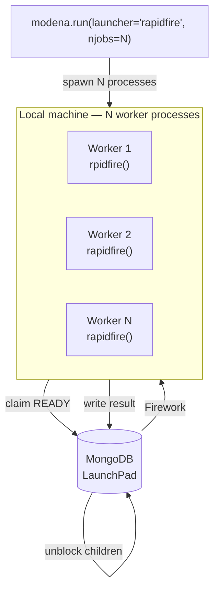
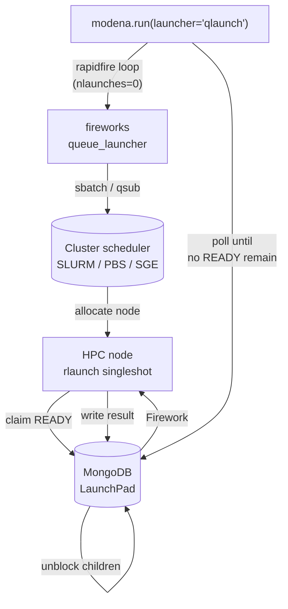
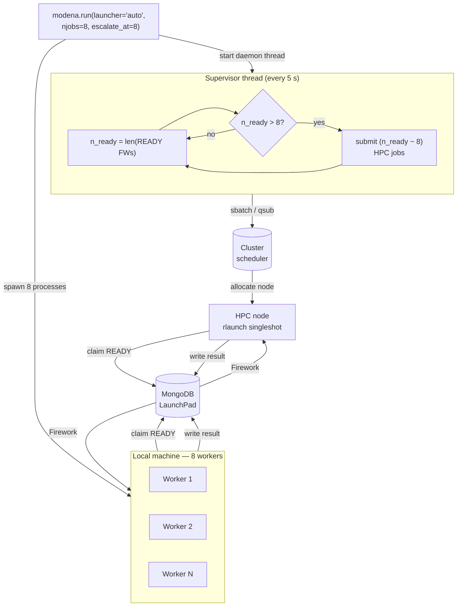
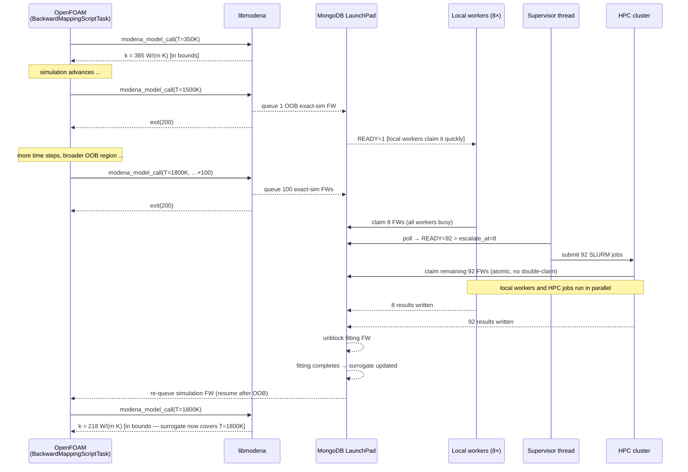

# FireWorks in MoDeNa

MoDeNa uses [FireWorks](https://materialsproject.github.io/fireworks/) as its
workflow engine.  This document explains the philosophy behind that choice, how
MoDeNa's strategies map onto FireWorks primitives, and how to operate the
workflow system from Python or the command line.

---

## Contents

1. [Why FireWorks?](#why-fireworks)
2. [FireWorks primitives](#fireworks-primitives)
3. [How Strategies map to FireWorks](#how-strategies-map-to-fireworks)
4. [The backward-mapping loop](#the-backward-mapping-loop)
5. [Running workflows with `modena.run()`](#running-workflows-with-modenarun)
6. [Launcher backends](#launcher-backends)
   - [`rapidfire` — local workers](#rapidfire--local-workers-default)
   - [`qlaunch` — HPC queue](#qlaunch--hpc-queue)
   - [`auto` — adaptive escalation](#auto--adaptive-escalation)
   - [Choosing a launcher](#choosing-a-launcher)
7. [Inspecting and managing the launchpad](#inspecting-and-managing-the-launchpad)
   - [`modena.lpad()` — factory](#modenalpad-factory)
   - [`ModenaLaunchPad` methods](#modenalaunchpad-methods)
   - [Connection internals](#connection-internals)
   - [`defuse_orphans`](#defuse_orphansmax_age_seconds3600)
   - [Tracing workflow ancestry with `retrace_to_origin`](#tracing-workflow-ancestry-with-retrace_to_origin)
8. [Firework naming](#firework-naming)
9. [Verbosity and logging](#verbosity-and-logging)
10. [Task serialization and `FW_config.yaml`](#task-serialization-and-fw_configyaml)
11. [Command-line reference](#command-line-reference)
    - [`modena fw` — FireWorks launchpad](#modena-fw-fireworks-launchpad)
    - [`modena model` — surrogate model database](#modena-model-surrogate-model-database)
    - [`modena init` — initialise surrogate models](#modena-init--initialise-surrogate-models)
    - [`modena doctor` — environment health check](#modena-doctor-environment-health-check)
    - [`modena quickstart` — usage guide](#modena-quickstart-usage-guide)
12. [Common pitfalls](#common-pitfalls)

---

## Why FireWorks?

A MoDeNa simulation is not a single program: it is a loop that may restart
itself whenever the surrogate model needs retraining.  FireWorks provides
exactly the infrastructure needed:

* **Persistent state** — workflow state is stored in MongoDB, so a crash or
  network interruption does not lose progress.
* **Dependency tracking** — parameter-fitting tasks run before the simulation
  restarts, without any custom scheduling logic.
* **Exit-code signalling** — a simulation that exits with code 200 is
  interpreted as "needs more training"; FireWorks re-queues the fitting task
  automatically (via `defuse_bad_rc`).
* **Distributed execution** — the same workflow can run locally (rapidfire) or
  on an HPC cluster (qlaunch) without changing application code.

---

## FireWorks primitives

| Primitive | Python class | Description |
|---|---|---|
| **FireTask** | `fireworks.FiretaskBase` | One unit of work (a Python callable). |
| **Firework** | `fireworks.Firework` | A list of FireTasks that run in sequence, plus metadata. |
| **Workflow** | `fireworks.Workflow` | A DAG of Fireworks connected by dependency links. |
| **LaunchPad** | `fireworks.LaunchPad` | MongoDB-backed queue that stores and dispatches Fireworks. |
| **Rocket** | internal | The worker process that pulls and executes a single Firework. |
| **rapidfire** | `fireworks.core.rocket_launcher.rapidfire` | Launches Rockets in a loop until no more READY Fireworks exist. |

### Firework states

```
WAITING → READY → RESERVED → RUNNING → COMPLETED
                                      ↘ FIZZLED
```

* `WAITING` — dependencies not yet complete.
* `READY` — ready to be picked up by a Rocket.
* `RESERVED` — a Rocket has claimed it but not yet started.
* `RUNNING` — actively executing.
* `COMPLETED` — finished successfully.
* `FIZZLED` — finished with an error (non-zero exit code that was not
  caught by `defuse_bad_rc`).
* `DEFUSED` — manually paused; will not run until re-queued.
* `PAUSED` — similar to DEFUSED.

---

## How Strategies map to FireWorks

Every `SurrogateModel` has an `initialisationStrategy` and a
`outOfBoundsStrategy`.  Both return objects whose `.workflow(model)` method
produces a `fireworks.Workflow`.

### Initialisation workflow

```
init root — flowRate, idealGas  (EmptyFireTask)
      │
      ├─→  flowRate — init (substitute models)
      │          │
      │          └─→  flowRate — fitting
      │
      └─→  idealGas — init (no-op)
                 │
                 └─→  (no further steps)
```

`modena.run(models)` creates one such sub-workflow per registered model and
chains them from a shared root so they run in parallel where possible.

### Simulation workflow

```
flowRate — sim 1/4
flowRate — sim 2/4    ── all collected ──►  flowRate — fitting
flowRate — sim 3/4
flowRate — sim 4/4
```

When a surrogate query falls outside its valid range:

```
mySimulation (BackwardMappingScriptTask)
      │
      ├─ exit 0  ─────────────────►  COMPLETED
      │
      └─ exit 200 ─►  defuse_bad_rc
                             │
                             └─►  flowRate — fitting
                                        │
                                        └─►  mySimulation — resume after OOB
```

`BackwardMappingScriptTask` wraps the simulation executable and sets
`defuse_bad_rc: true` on exit code 200.  When the surrogate is queried outside
its valid range, `libmodena` sets the process exit code to 200 and returns.
FireWorks catches this, creates a new fitting Firework, and re-queues the
simulation — the backward-mapping loop.

---

## The backward-mapping loop

```
Simulation  →  query surrogate  →  in range?
                                      │ yes: use value, continue
                                      │ no:  exit(200)
                                         │
                              FireWorks catches exit 200
                                         │
                              ParameterFittingTask runs
                                         │
                              Simulation restarts (new Firework)
```

From the application developer's perspective, calling `modena_model_call`
in C, `modena.callModel` in Python, or `model(inputs)` in Python is all that
is needed.  The loop is entirely managed by FireWorks and `libmodena`.

---

## Running workflows with `modena.run()`

`modena.run()` is the recommended entry point for both initialisation and
simulation workflows.  It handles LaunchPad setup, workflow construction, and
progress reporting.

```python
import modena

# Initialise all registered surrogate models
import flowRate  # registers the model
modena.run(list(modena.SurrogateModel.get_instances()))

# Run a simulation workflow
from fireworks import Firework, Workflow
import mySimulation
wf = Workflow([Firework(mySimulation.m)], name='mySimulation')
modena.run(wf)
```

### Signature

```python
modena.run(
    wf_or_models,
    *,
    lpad=None,
    reset=True,
    sleep_time=0,
    timeout=None,
    name='modena_workflow',
    njobs=0,
    launcher='rapidfire',
    fworker=None,
    qadapter=None,
    launch_dir='.',
    escalate_at=0,
)
```

| Parameter | Default | Description |
|---|---|---|
| `wf_or_models` | — | A `Workflow`, a `Firework`, or a list of `SurrogateModel` instances. |
| `lpad` | `None` | LaunchPad to use.  Created from `MODENA_URI` if not provided. |
| `reset` | `True` | Reset the launchpad before adding the workflow. |
| `sleep_time` | `0` | Seconds to sleep between polling cycles. |
| `timeout` | `None` | Wall-clock timeout in seconds (`rapidfire` and `auto` only). |
| `name` | `'modena_workflow'` | Workflow name when building from a model list. |
| `njobs` | `0` | Local worker count (`rapidfire`/`auto`: 0 = cpu_count, 1 = sequential); HPC queue cap (`qlaunch`: 0 = unlimited). |
| `launcher` | `'rapidfire'` | Launcher backend: `'rapidfire'`, `'qlaunch'`, or `'auto'`. |
| `fworker` | `None` | `FWorker` instance or path to `fworker.yaml` (`qlaunch`/`auto` only). |
| `qadapter` | `None` | `QueueAdapterBase` instance or path to `qadapter.yaml` (required for `qlaunch`/`auto`). |
| `launch_dir` | `'.'` | Directory from which HPC batch scripts are submitted (`qlaunch`/`auto` only). |
| `escalate_at` | `0` | READY Firework count above which the supervisor starts submitting to HPC (`auto` only). |

Returns the `ModenaLaunchPad` used, allowing post-run inspection:

```python
lp = modena.run(wf)
print(lp.state_summary())
```

---

## Launcher backends

`modena.run()` supports three launcher backends selected via the `launcher`
parameter.  All three share the same MongoDB launchpad as coordination point:
every Firework is claimed atomically, so mixed deployments (local workers
**and** HPC jobs running simultaneously) never execute the same Firework twice.

### `rapidfire` — local workers (default)

Worker processes are spawned on the local machine.  Each worker polls MongoDB,
claims a READY Firework, executes it, and repeats until the queue is empty.
`njobs` controls the worker count (0 = `os.cpu_count()`; 1 = sequential in
the calling process).



**When to use:** development, small initialisation runs, or any workflow where
all exact simulations fit comfortably on the local machine.

```python
# 8 local workers
modena.run(models, njobs=8)

# sequential — useful for debugging exact tasks
modena.run(models, njobs=1)
```

---

### `qlaunch` — HPC queue

Each READY Firework is submitted as an independent batch job to the cluster
scheduler (SLURM, PBS, SGE, …).  The scheduler allocates nodes; the job runs
`rlaunch singleshot` which claims one Firework from MongoDB, executes it, and
exits.  `njobs` caps the number of jobs held in the queue simultaneously
(0 = unlimited).



**When to use:** large initialisation runs (hundreds of expensive exact
simulations), or any workflow where local CPUs are insufficient.

Requires a `qadapter.yaml` that describes the cluster queue system.
A minimal SLURM example:

```yaml
# qadapter.yaml
_fw_name: CommonAdapter
_fw_q_type: SLURM
rocket_launch: rlaunch singleshot
nodes: 1
walltime: "04:00:00"
queue: compute
```

```python
# Submit all simulations to SLURM, max 64 in queue at once
modena.run(models,
           launcher='qlaunch',
           qadapter='qadapter.yaml',
           njobs=64)
```

```bash
modena init all \
  --launcher qlaunch \
  --qadapter qadapter.yaml \
  --jobs 64
```

---

### `auto` — adaptive escalation

Starts local `rapidfire` workers **and** a supervisor thread.  The supervisor
polls the READY count every few seconds.  When the count exceeds `escalate_at`,
it submits one HPC job per overflow Firework.  Local workers and HPC jobs
compete for claims; MongoDB's atomic claiming ensures no double-execution.

This is the right mode when a long-running macroscopic simulation (e.g.
OpenFOAM) is running in the workflow and may suddenly trigger large bursts of
exact simulations through out-of-bounds events.



#### Out-of-bounds burst scenario

The sequence below illustrates how `auto` handles a real OpenFOAM + LAMMPS
run where the surrogate is initially trained but then encounters a large
unexplored region mid-simulation.



```python
modena.run(
    wf,
    launcher='auto',
    njobs=8,
    escalate_at=8,
    qadapter='qadapter.yaml',
    launch_dir='/scratch/modena',
)
```

```bash
modena init all \
  --launcher auto \
  --jobs 8 \
  --escalate-at 8 \
  --qadapter qadapter.yaml \
  --launch-dir /scratch/modena
```

---

### Choosing a launcher

| Situation | Launcher | Key parameters |
|---|---|---|
| Development / debugging | `rapidfire` | `njobs=1` |
| Small initialisation (< ~20 expensive sims) | `rapidfire` | `njobs=cpu_count` |
| Large batch initialisation (100s of sims) | `qlaunch` | `njobs=<queue cap>` |
| Long macroscopic run with rare OOB events | `rapidfire` | default |
| Long macroscopic run with potential OOB bursts | `auto` | `escalate_at=njobs` |
| Cluster-only deployment (no local compute) | `qlaunch` | `njobs=0` |

**Key insight:** all three launchers are interchangeable from the workflow's
perspective.  The Fireworks and their dependencies are identical in all cases;
only who executes them changes.  You can switch launcher between runs without
touching the model or workflow code.

---

## Inspecting and managing the launchpad

### `modena.lpad()` — factory

```python
import modena

lp = modena.lpad()          # connect to the active MODENA_URI
```

This is a thin wrapper around `ModenaLaunchPad.from_modena_uri()`.  It
immediately verifies the MongoDB connection with a lightweight `ping` command.
If MongoDB is not reachable it raises `ModenaConnectionError` with a clear
message instead of hanging silently.

To increase the connection timeout (e.g. for a remote or slow MongoDB):

```python
from modena.Launchpad import ModenaLaunchPad
lp = ModenaLaunchPad.from_modena_uri(server_selection_timeout_ms=10_000)
```

The default `server_selection_timeout_ms` is **3000 ms** (3 seconds).

### `ModenaLaunchPad` methods

```python
lp.status()                 # print table: fw_id, name, state, created, updated
lp.state_counts()           # dict: {'READY': 1, 'COMPLETED': 3, ...}
lp.state_summary()          # str: 'READY=1, COMPLETED=3'

lp.reset()                  # clear all fireworks (warns if RUNNING/RESERVED exist)
lp.defuse_orphans()         # re-queue RUNNING/RESERVED fireworks whose process died
lp.rerun(fw_id)             # re-queue a specific FIZZLED or COMPLETED firework
lp.retrace_to_origin(fw_id) # print + return the ancestor graph up to fw_id
```

`ModenaLaunchPad` inherits from FireWorks `LaunchPad`; all standard FireWorks
`LaunchPad` methods are also available.

### Connection internals

`from_modena_uri()` builds the LaunchPad in `uri_mode=True`, passing the full
`MODENA_URI` string directly to PyMongo's `MongoClient`.  This avoids passing
`username=None` and `authSource` as explicit kwargs (the legacy approach),
which could trigger unintended authentication handshakes in some PyMongo
versions.  The `serverSelectionTimeoutMS` kwarg is injected via
`mongoclient_kwargs` so that failed connections are detected in ≤3 seconds
rather than after PyMongo's 30-second default.

### `defuse_orphans(max_age_seconds=3600)`

A firework is considered orphaned if:

* Its launch has been in `RUNNING` or `RESERVED` state for longer than
  `max_age_seconds` (default: 1 hour), **or**
* The launch host matches the current machine and the recorded PID is no
  longer alive (Linux/macOS only).

Call this after a crash to recover stuck fireworks:

```python
lp = modena.lpad()
lp.defuse_orphans()           # re-queues orphans → READY
modena.run(wf, reset=False)   # resume without losing existing state
```

### Tracing workflow ancestry with `retrace_to_origin`

After a run completes, `retrace_to_origin` walks the workflow graph backwards
from any Firework and prints the full ancestry chain — every Firework that had
to complete before the target:

```python
lp = modena.lpad()
fws = lp.retrace_to_origin(12)
```

Example output for a coolProp surrogate initialisation:

```
────────────────────────────────────────────────────────────────────────
Retrace to fw:12 "validate density[fluid=CO2]"
────────────────────────────────────────────────────────────────────────
Depth 0  (root)
  [fw:1   ]  init root — density[fluid=CO2]          COMPLETED
             tasks: EmptyFireTask
             ↓ (1 → 1)

Depth 1
  [fw:2   ]  density[fluid=CO2] — init (no-op)       COMPLETED
             tasks: InitialPoints
             ↓ (1 → 9)

Depth 2  [9 parallel]
  [fw:3   ]  density[fluid=CO2] — sim 1/9            COMPLETED
             tasks: CoolPropExactSim
  [fw:4   ]  density[fluid=CO2] — sim 2/9            COMPLETED
             tasks: CoolPropExactSim
  ...
             ↓ (9 → 1)

Depth 3
  [fw:11  ]  density[fluid=CO2] — fitting            COMPLETED
             tasks: NonLinFitWithErrorContol
             ↓ (1 → 1)

Depth 4  ★ target
  [fw:12  ]  validate density[fluid=CO2]             COMPLETED ★
             tasks: CoolPropValidationTask

────────────────────────────────────────────────────────────────────────
12 Firework(s) traced
```

`retrace_to_origin` returns a list of `Firework` objects in topological order
(roots first, target last), suitable for programmatic inspection:

```python
for fw in fws:
    print(fw.fw_id, fw.name, fw.state)
```

Detour Fireworks inserted at runtime by `FWAction(detours=[...])` (e.g. when an
out-of-bounds event triggers extra simulations) appear at their correct depth —
they are already wired into `wf.links` by FireWorks before the workflow
completes.

---

## Firework naming

All Fireworks produced by MoDeNa strategies follow the convention:

```
{model._id} — {role}
```

Examples:

| Firework name | Where created |
|---|---|
| `init root — flowRate, idealGas` | `modena.run()` root Firework |
| `flowRate — init (substitute models)` | `InitialisationStrategy.workflow()` |
| `flowRate — init (no-op)` | `EmptyInitialisationStrategy.workflow()` |
| `flowRate — sim 3/9` | `BackwardMappingModel.exactTasks()` |
| `flowRate — fitting` | `ParameterFittingStrategy.workflow()` |
| `flowRate — resume after OOB` | OOB detour re-queue Firework |
| `flowRate — resume after init` | init detour re-queue Firework |

This makes `modena fw status` and `retrace_to_origin` output human-readable
without needing to look up Firework IDs.

---

## Verbosity and logging

### FireWorks output is silenced by default

FireWorks emits INFO-level messages on every Rocket launch, task start, and
task completion.  These are routine infrastructure noise and are suppressed by
default in all MoDeNa entry points (`modena.run()` and `modena.lpad()`).

**Important:** FireWorks does **not** use the `"fireworks"` logger hierarchy.
It creates standalone loggers named `"launchpad"`, `"rocket.launcher"`, etc.
via its internal `get_fw_logger()` factory.  `logging.getLogger('fireworks').setLevel()`
has no effect on these.  The only way to control FireWorks verbosity is via the
`strm_lvl` argument passed when those loggers are first created — i.e. at
`LaunchPad(strm_lvl=...)` construction and `rapidfire(strm_lvl=...)` call time.
MoDeNa passes `strm_lvl` automatically via the `_fw_strm_lvl()` helper in
`Launchpad.py`.

### `DEBUG_VERBOSE` — full FireWorks output

Set the modena log level to `DEBUG_VERBOSE` (numeric 5, below `DEBUG=10`) to
re-enable FireWorks output:

```python
import modena
modena.configure_logging(level='DEBUG_VERBOSE')
modena.run(wf)
```

Or via environment variable (takes priority over `modena.toml`):

```bash
MODENA_LOG_LEVEL=DEBUG_VERBOSE ./initModels
```

### Log levels

| Level | Modena messages | FireWorks messages |
|---|---|---|
| `WARNING` | warnings and errors only | silent |
| `INFO` | normal progress (default) | silent |
| `DEBUG` | full modena debug | silent |
| `DEBUG_VERBOSE` | full modena debug | full FireWorks output |

### Configure in `modena.toml`

```toml
[logging]
level = "WARNING"
file  = "modena.log"   # optional — also write timestamped log to this file
```

The `[logging]` section is read from all three config layers (system `/etc/modena/config.toml`,
user `~/.modena/config.toml`, project `modena.toml`).  `MODENA_LOG_LEVEL` env var
overrides the toml value.

---

## Task serialization and `FW_config.yaml`

### How FireWorks deserializes tasks

FireWorks serializes `@explicit_serialize` task classes by class name and
reconstructs them from a global registry (`_fw_registry`).  The registry is
populated only when the module defining the class is imported.

**Rule:** Every `FireTaskBase` subclass decorated with `@explicit_serialize`
must be defined in a proper Python module (a `.py` file on `sys.path`), not
in a workflow script.  Workflow scripts (`initModels`, `workflow`) are not
importable — they have no `.py` extension and are not on `sys.path`.

If a task is defined in a workflow script, FireWorks serializes it with that
script as the module name.  When a Rocket subprocess later deserializes the
task from MongoDB, `__import__('workflow')` fails with
`ModuleNotFoundError: No module named 'workflow'`.

**Correct pattern:**

```
examples/MoDeNaModels/myModel/python/
    myModel.py       ← define ALL FireTask subclasses here
    __init__.py      ← re-export: from .myModel import MyTask, m

examples/myExample/
    FW_config.yaml   ← see below
    workflow         ← import MyTask from myModel; do NOT define it here
```

### `FW_config.yaml` — `[modena]` is sufficient

When `modena` is imported it automatically imports every model package
discovered in the registered prefixes (from `modena.toml` `[models] paths` or
`MODENA_PATH`).  This ensures all `@explicit_serialize` task classes are in
`_fw_registry` before any Rocket deserializes tasks.

A minimal `FW_config.yaml` therefore only needs:

```yaml
ADD_USER_PACKAGES:
    - modena
REMOVE_USELESS_DIRS: True
```

**Prerequisite:** the model package must be installed into a prefix registered
in `modena.toml` or `MODENA_PATH`.  Packages in unregistered locations are not
auto-imported; list them explicitly in `ADD_USER_PACKAGES` as a fallback.

### How auto-import works

After `ModelRegistry().load()` adds model prefixes to `sys.path`, `__init__.py`
calls `active_packages()` which scans `.dist-info` directories in all registered
prefixes.  Each discovered package is imported via `importlib.import_module`.
Import failures are silently logged at `DEBUG` level and do not abort startup.

---

## Command-line reference

Commands are grouped into four categories:

```
modena fw        <command>   — FireWorks launchpad operations
modena model     <command>   — Surrogate model database operations
modena doctor               — Environment health check
modena quickstart           — Usage guide
```

### `modena fw` — FireWorks launchpad

| Command | Description |
|---|---|
| `modena fw status` | Print a table of all Firework IDs, names, and states. |
| `modena fw reset` | Interactively reset the launchpad (prompts for confirmation). |
| `modena fw reset --force` | Reset without prompting. |
| `modena fw rerun <fw_id>` | Re-queue a specific FIZZLED or COMPLETED firework. |
| `modena fw orphans` | Re-queue RUNNING/RESERVED fireworks whose process has died. |
| `modena fw orphans --max-age <s>` | Use a custom age threshold in seconds (default 3600). |
| `modena fw run --script <name>` | Wrap a shell script as a `BackwardMappingScriptTask` and generate a workflow YAML. |
| `modena fw run --workflow <file>` | Add a FireWorks YAML file to the launchpad and launch it. |
| `modena fw run --py <file>` | Execute a Python workflow script directly. |

### `modena model` — surrogate model database

| Command | Description |
|---|---|
| `modena model ls` | List all surrogate models with their function signatures. |
| `modena model show <id>` | Show full details for a single model (inputs, outputs, fitted parameters). |
| `modena model freeze [-o FILE]` | Snapshot model parameters and package versions to a lock file. |
| `modena model restore [-i FILE]` | Restore model parameters from a lock file. |
| `modena model restore --verify-only` | Check version consistency only; do not write to DB. |

### `modena init` — initialise surrogate models

```bash
modena init all                        # initialise every registered model
modena init 'thermalDiffusion[material=Cu]'   # one specific model
modena init 'modelA' 'modelB'          # subset by ID
```

| Flag | Default | Description |
|---|---|---|
| `--jobs N` / `-j N` | `0` (cpu_count) | Worker count (`rapidfire`/`auto`) or queue cap (`qlaunch`). |
| `--sequential` | off | Run one simulation at a time (equivalent to `--jobs 1`). |
| `--launcher` | `rapidfire` | `rapidfire`, `qlaunch`, or `auto`. |
| `--qadapter PATH` | — | Path to `qadapter.yaml` (required for `qlaunch`/`auto`). |
| `--fworker PATH` | — | Path to `fworker.yaml` (optional; accepts any FW by default). |
| `--launch-dir DIR` | `.` | Directory from which batch scripts are submitted. |
| `--escalate-at N` | `0` | READY count threshold for HPC escalation (`auto` only). |

Examples:

```bash
# Sequential — easy to debug exact tasks
modena init all --sequential

# 4 local workers
modena init all --jobs 4

# All simulations go to SLURM
modena init all \
  --launcher qlaunch \
  --qadapter qadapter.yaml

# Local workers for small jobs; HPC for bursts > 8 READY
modena init all \
  --launcher auto \
  --jobs 8 \
  --escalate-at 8 \
  --qadapter qadapter.yaml \
  --launch-dir /scratch/modena
```

### `modena doctor` — environment health check

```bash
modena doctor
```

Reports the status of every MoDeNa dependency and configuration item:

* libmodena shared library (`libmodena.so`)
* `modena.toml` project config file
* MongoDB connectivity (2 s timeout)
* Required Python packages (scipy, fireworks, mongoengine, jinja2, pymongo)
* Optional Python packages (CoolProp, rpy2)
* Environment variables (`MODENA_URI`, `MODENA_SURROGATE_LIB_DIR`, `MODENA_LOG_LEVEL`, `MODENA_PATH`)

Each item is marked `✓`, `✗`, or `—` (optional/not configured).  Run this
before filing a bug report or when setting up a new environment.

### `modena quickstart` — usage guide

```bash
modena quickstart
```

Prints a 5-step inline guide covering the typical development workflow:
environment setup, model definition, initialisation, running a simulation,
and inspecting results.  Includes a reference table of useful Python one-liners
(`lp.status()`, `lp.retrace_to_origin(fw_id)`, `modena.load()`, etc.).

### Examples

```bash
# Check what is currently in the launchpad
modena fw status

# Clear the launchpad after a failed run
modena fw reset --force

# Recover fireworks stuck after a crash
modena fw orphans

# Re-run a specific firework
modena fw rerun 42

# List all trained surrogate models
modena model ls

# Inspect the flowRate model
modena model show flowRate

# Snapshot the current model state before an experiment
modena model freeze -o experiment_01.lock

# Restore a previous model state
modena model restore -i experiment_01.lock

# Verify the environment is set up correctly
modena doctor
```

---

## Common pitfalls

### `rapidfire` hangs silently

**Symptom**: `initModels` or `workflow` appears to do nothing for a long time.

**Cause**: Before MoDeNa 3, `rapidfire` was called without `sleep_time=0`.
The default is 60 seconds — `rapidfire` polls every minute, causing a
seemingly frozen process between firework batches.

**Fix**: Always use `modena.run()`, which passes `sleep_time=0`.  If calling
`rapidfire` directly, always pass `sleep_time=0`.

### Workflow stalls with RUNNING/RESERVED fireworks

**Symptom**: `modena fw status` shows fireworks stuck in `RUNNING` or `RESERVED`
after a crash.

**Fix**:
```bash
modena fw orphans
```

Or from Python:
```python
lp = modena.lpad()
lp.defuse_orphans()
```

### `callModel` exits with code 200

**Symptom**: The simulation exits immediately; no output produced.

**Explanation**: This is expected behaviour.  Exit code 200 signals that the
surrogate was queried outside its valid range.  FireWorks will automatically
trigger parameter fitting and restart the simulation.  If the loop never
converges, increase the number of training points in the initialisation
strategy or widen the input bounds.

### `ModuleNotFoundError: No module named 'workflow'`

**Symptom**: A Rocket subprocess fails with:

```
ModuleNotFoundError: No module named 'workflow'
```

**Cause**: A `@explicit_serialize` FireTask class was defined in the `workflow`
script instead of in an importable Python module.  When a rocket tries to
deserialize the task from MongoDB it attempts `__import__('workflow')`, which
fails because `workflow` is a shell script with no `.py` extension.

**Fix**: Move the FireTask class into the model's `myModel.py` package module
and re-export it from `__init__.py`.  The `workflow` script should only import
from the package, never define task classes.  See
[Task serialization and `FW_config.yaml`](#task-serialization-and-fw_configyaml).

### FireWorks INFO messages flooding the terminal

**Symptom**: The terminal is flooded with messages like:

```
2026-03-17 10:02:05,123 INFO Rocket launching...
2026-03-17 10:02:05,456 INFO Task completed: NonLinFitWithErrorContol
```

**Explanation**: FireWorks' standalone loggers (`"launchpad"`, `"rocket.launcher"`)
bypass the `"fireworks"` logger hierarchy.  `logging.getLogger('fireworks').setLevel(WARNING)`
has no effect on them.

**Fix**: These messages are already suppressed when using `modena.run()` or
`modena.lpad()`.  If you are constructing a `LaunchPad` directly, pass
`strm_lvl='WARNING'`:

```python
from fireworks import LaunchPad
lp = LaunchPad.from_file('my_launchpad.yaml', strm_lvl='WARNING')
```

To re-enable FireWorks output for debugging, use `DEBUG_VERBOSE`:

```bash
MODENA_LOG_LEVEL=DEBUG_VERBOSE ./initModels
```

### MongoDB is not running — commands hang or fail immediately

**Symptom**: `modena fw status` (or any `modena.run()` call) exits with:

```
[modena] Cannot connect to MongoDB at: mongodb://localhost:27017/test

  Make sure MongoDB is running before using MoDeNa:
    sudo systemctl start mongod    # systemd
    mongod --dbpath /data/db       # manual
  ...
```

**Cause**: `mongod` is not running, or `MODENA_URI` points to the wrong host/port.
`ModenaLaunchPad.from_modena_uri()` sends a `ping` to MongoDB immediately after
creating the client.  If the server does not respond within
`server_selection_timeout_ms` (default 3 s) it raises `ModenaConnectionError`.

**Fix**: Start MongoDB, then retry:
```bash
sudo systemctl start mongod   # or: mongod --dbpath /data/db
modena fw status
```

To use a different MongoDB instance:
```bash
export MODENA_URI=mongodb://myhost:27017/modena
modena fw status
```

### All exact simulations DEFUSED after one numerical failure

**Symptom**: `initModels` completes with `COMPLETED=2, DEFUSED=30` (or similar)
even though the model should have 30 training points.  The log shows an
exception such as:

```
ValueError: One stationary point (not good) for T=341.844, p=519967, ...
```

**Cause**: Pre-3.x behaviour was to return `FWAction(defuse_workflow=True)` on
any exception from an exact simulation task, which cancelled all remaining
sibling simulations.

**Fix**: The default behaviour since 3.x is `SkipPoint()` — the failing point
is skipped and all other exact simulations continue.  To make this explicit in
your model definition (recommended for models where numerical failures are
expected at certain input combinations):

```python
m = BackwardMappingModel(
    _id='myModel',
    ...
    nonConvergenceStrategy=Strategy.SkipPoint(),
)
```

If you want failures to be immediately visible instead of silently skipped,
use `Strategy.FizzleOnFailure()` during development.

### LaunchPad connects to wrong MongoDB

**Symptom**: `modena fw status` shows an empty or unexpected launchpad even
though MongoDB is running.

**Fix**: Check `MODENA_URI` is set correctly:
```bash
echo $MODENA_URI
# mongodb://localhost:27017/modena
```

See `docs/quick-start-developer.md` for environment setup instructions.
