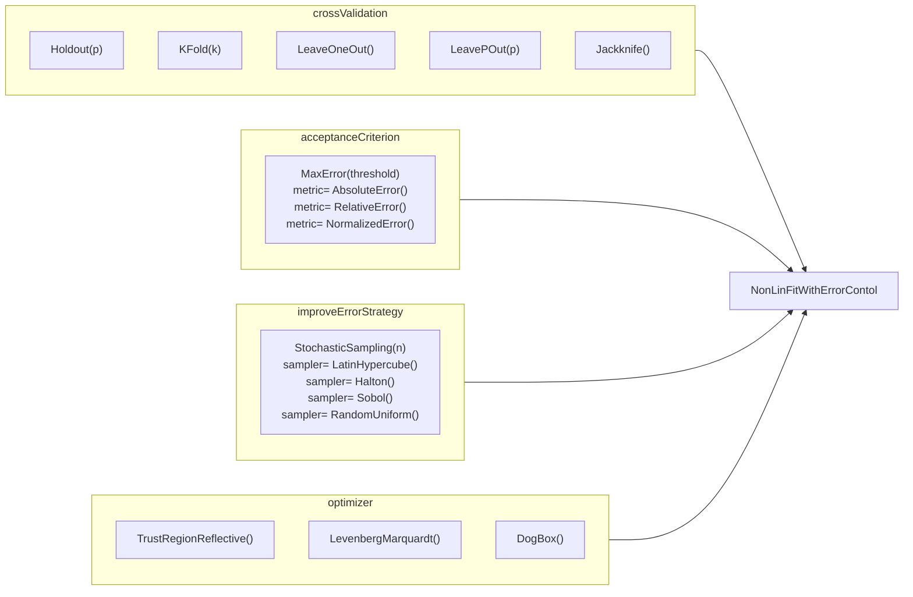

# Quick-Start Guide — Integrating MoDeNa Models into Your Code

This guide explains how to call an existing MoDeNa surrogate model from your
simulation code and how to define a new model from scratch.  The `flowRate`
model from the `twoTanks` example is used throughout.

---

## Core concepts

```
┌──────────────────────────────────────────────────────────────┐
│  Macroscopic solver  (C++, Fortran, MATLAB, Python, …)       │
│                                                              │
│   calls modena_model_call() ──► surrogate (.so)  ◄── fast   │
│              │                                               │
│              │ out of bounds?                                │
│              ▼                                               │
│         return code 200 ──► FireWorks ──► exact simulation   │
│                                      ──► parameter fitting   │
│                                      ──► restart solver      │
└──────────────────────────────────────────────────────────────┘
```

**Surrogate function** — a compiled C shared library that evaluates a
polynomial or other analytical approximation.  Built automatically from C code
embedded in the model definition.

**Surrogate model** — a MongoDB document that stores the surrogate function
reference, current fitted parameters, input/output bounds, and training data.

**Backward mapping** — the adaptive loop: the macroscopic solver runs, the
surrogate is evaluated, and when a query falls outside the trained region the
exact simulation is called, the surrogate is refitted, and the solver restarts.

---

## Calling a model from C/C++

Link against `libmodena` and include `modena.h`.  The pattern is:
**load once before the time loop → set inputs → call → read outputs → handle
return code**.

```c
#include "modena.h"
#include <stdlib.h>

int main(void)
{
    /* ── Load model and allocate I/O vectors ── */
    modena_model_t   *model   = modena_model_new("flowRate");
    modena_inputs_t  *inputs  = modena_inputs_new(model);
    modena_outputs_t *outputs = modena_outputs_new(model);

    /* ── Cache input/output positions (do this ONCE, before the loop) ── */
    size_t pos_D       = modena_model_inputs_argPos(model,  "D");
    size_t pos_rho0    = modena_model_inputs_argPos(model,  "rho0");
    size_t pos_p0      = modena_model_inputs_argPos(model,  "p0");
    size_t pos_p1Byp0  = modena_model_inputs_argPos(model,  "p1Byp0");
    size_t pos_mdot    = modena_model_outputs_argPos(model, "flowRate");

    /* Verify that every declared input/output was queried */
    modena_model_argPos_check(model);

    /* ── Time-step loop ── */
    while (t < t_end)
    {
        t += dt;

        modena_inputs_set(inputs, pos_D,      D);
        modena_inputs_set(inputs, pos_rho0,   rho0);
        modena_inputs_set(inputs, pos_p0,     p0);
        modena_inputs_set(inputs, pos_p1Byp0, p1 / p0);

        int ret = modena_model_call(model, inputs, outputs);

        if (ret == 100) { t -= dt; continue; }   /* retrained — retry step */
        if (ret != 0)   { exit(ret); }            /* 200/201 — let FireWorks handle */

        double mdot = modena_outputs_get(outputs, pos_mdot);
        /* use mdot … */
    }

    /* ── Clean up ── */
    modena_inputs_destroy(inputs);
    modena_outputs_destroy(outputs);
    modena_model_destroy(model);
    return 0;
}
```

**CMakeLists.txt** to link against modena:

```cmake
find_package(MODENA REQUIRED)
target_link_libraries(myApp MODENA::modena)
```

---

## Thread-safe evaluation from C

`modena_model_t` is read-only after initialisation and can be shared
across threads.  Each thread needs only its own `modena_inputs_t` /
`modena_outputs_t` pair.  `modena_model_call()` manages the CPython GIL
internally, so no `Py_BEGIN_ALLOW_THREADS` wrapper is required in
application code — this works for pthreads, OpenMP, and hybrid MPI+OpenMP.

```c
/* Main thread — load once */
modena_model_t *model = modena_model_new("flowRate");
/* … argPos setup … */

/* Each worker thread */
modena_inputs_t  *in  = modena_inputs_new(model);
modena_outputs_t *out = modena_outputs_new(model);
modena_model_call(model, in, out);   /* GIL-safe, concurrent */
modena_inputs_destroy(in);
modena_outputs_destroy(out);

/* Main thread — after all threads finish */
modena_model_destroy(model);
```

For full examples (pthreads parametric sweep, OpenMP, MPI notes) see
[quick-start-c.md — Thread-safe evaluation](quick-start-c.md#thread-safe-evaluation)
and the `examples/MoDeNaModels/twoTankMT/` reference implementation.

---

## Calling a model from Fortran

Use the `fmodena_oop` module (Fortran 2003).  Resources are released
automatically when the `modena_model` variable goes out of scope.

```fortran
program twoTanks
    use fmodena_oop
    use iso_c_binding
    implicit none

    type(modena_model) :: m
    integer(c_size_t)  :: pos_D, pos_rho0, pos_p0, pos_p1Byp0, pos_mdot
    integer(c_int)     :: ret
    real(c_double)     :: D, rho0, p0, p1Byp0, mdot, t, dt, t_end

    ! ── Load model ──────────────────────────────────────────────────────────
    call m%init("flowRate")

    ! ── Cache positions (once, before the loop) ─────────────────────────────
    pos_D      = m%input_pos("D")
    pos_rho0   = m%input_pos("rho0")
    pos_p0     = m%input_pos("p0")
    pos_p1Byp0 = m%input_pos("p1Byp0")
    pos_mdot   = m%output_pos("flowRate")
    call m%check()

    ! ── Time-step loop ───────────────────────────────────────────────────────
    do while (t < t_end)
        t = t + dt

        call m%set(pos_D,      D)
        call m%set(pos_rho0,   rho0)
        call m%set(pos_p0,     p0)
        call m%set(pos_p1Byp0, p1 / p0)

        ret = m%call()

        if (ret == 100) then
            t = t - dt        ! surrogate retrained — retry this step
            cycle
        end if
        if (ret /= 0) call exit(ret)   ! 200/201 — FireWorks takes over

        mdot = m%get_output(pos_mdot)
        ! use mdot …
    end do

    ! m is destroyed automatically by the Fortran finaliser

end program twoTanks
```

**CMakeLists.txt:**

```cmake
find_package(MODENA REQUIRED)
target_link_libraries(myApp MODENA::fmodena_oop)
```

---

## Calling a model from MATLAB / Octave

Use the `Modena` class, which wraps the MEX gateway.

```matlab
% ── Load model ──────────────────────────────────────────────────────────────
m = Modena('flowRate');

% ── Cache positions (once, before the loop) ─────────────────────────────────
pos_D      = input_pos(m, 'D');
pos_rho0   = input_pos(m, 'rho0');
pos_p0     = input_pos(m, 'p0');
pos_p1Byp0 = input_pos(m, 'p1Byp0');
pos_mdot   = output_pos(m, 'flowRate');
check(m);

% ── Time-step loop ───────────────────────────────────────────────────────────
while t < t_end
    t = t + dt;

    set_input(m, pos_D,      D);
    set_input(m, pos_rho0,   rho0);
    set_input(m, pos_p0,     p0);
    set_input(m, pos_p1Byp0, p1 / p0);

    code = call(m);

    if code == 100, t = t - dt; continue; end   % retrained — retry step
    if code == 200 || code == 201, exit(code); end

    mdot = get_output(m, pos_mdot);
    % use mdot …
end

% m is freed automatically when it goes out of scope (RAII destructor)
```

The MEX gateway (`modena_gateway`) must be on the MATLAB path.  It is
installed to `${MODENA_MATLAB_DIR}` by CMake.  Add it once in `startup.m`:

```matlab
addpath(getenv('MODENA_MATLAB_DIR'));
```

---

## Defining a new model

A model package is a standard Python package that defines three things:
a **surrogate function** (C code), a **surrogate model** (MongoDB document),
and an **exact task** (FireTask that runs the expensive simulation).

The `flowRate` model (`examples/MoDeNaModels/flowRate/python/flowRate.py`)
is the canonical reference.

### 1 — Surrogate function

The surrogate function is C code with a specific signature, defined inline
using `CFunction`.  MoDeNa compiles it to a shared library automatically.

```python
from modena import CFunction

f = CFunction(
    Ccode='''
#include "modena.h"
#include "math.h"

void two_tank_flowRate
(
    const modena_model_t* model,
    const double* inputs,
    double* outputs
)
{
       /* MoDeNa injects variable bindings here */

    const double P0 = parameters[0];
    const double P1 = parameters[1];

    outputs[0] = M_PI * pow(D, 2.0) * P1 * sqrt(P0 * rho0 * p0);
}
''',
    inputs={
        'D':      {'min': 0,    'max': 9e99},
        'rho0':   {'min': 0,    'max': 9e99},
        'p0':     {'min': 0,    'max': 9e99},
        'p1Byp0': {'min': 0,    'max': 1.0 },
    },
    outputs={
        'flowRate': {'min': 9e99, 'max': -9e99, 'argPos': 0},
    },
    parameters={
        'param0': {'min': 0.0, 'max': 10.0, 'argPos': 0},
        'param1': {'min': 0.0, 'max': 10.0, 'argPos': 1},
    },
)
```

The `` block is filled in by MoDeNa's Jinja2 template
engine, which generates `const double D = inputs[0];` style bindings for each
declared input.  You use those variable names directly in the C body.

**`argPos` — the index contract between Python and C:**

`argPos` is the integer index into the `double[]` arrays that the C runtime and
the compiled surrogate exchange.  It is set once at model creation and stored in
MongoDB.  The rules are:

| Variable kind | argPos | Rule |
|---|---|---|
| **inputs** | not specified | Assigned automatically: scalars first (0, 1, 2, …), then `IndexSet`-backed vector inputs |
| **outputs** | required | Must be unique, starting from 0.  `outputs[argPos]` in your C code. |
| **parameters** | required | Must be unique, starting from 0.  `parameters[argPos]` in your C code. |

**Never change `argPos` on a model that already has data in MongoDB.**  Doing so
silently shifts which array slot the C application reads, corrupting all
existing results without any error message.  If you need to add a new input
to an existing model, append it at the next available index and update the C
application code.

### 2 — Exact task

The exact task is a FireWorks `FireTask` that runs the expensive simulation
and writes its output back into `self['point']`.

```python
from fireworks.utilities.fw_utilities import explicit_serialize
from modena import ModenaFireTask
from jinja2 import Template
import os

@explicit_serialize
class FlowRateExactSim(ModenaFireTask):

    def task(self, fw_spec):
        # Write inputs to a file the simulation executable expects
        Template('{{ s.point.D }}\n{{ s.point.p0 }}\n').stream(s=self).dump('in.txt')

        # Locate the binary: checks MODENA_BIN_PATH / [binaries] paths in
        # modena.toml, then falls back to bin/ alongside this .py file.
        binary = self.find_binary('flowRateExact')
        ret = os.system(binary)
        self.handleReturnCode(ret)

        # Read output and store it back so MoDeNa can use it for fitting
        with open('out.txt') as fh:
            self['point']['flowRate'] = float(fh.readline())
```

### 3 — Surrogate model

Wire the surrogate function and exact task together with a `BackwardMappingModel`:

```python
from modena import BackwardMappingModel
import modena.Strategy as Strategy

m = BackwardMappingModel(
    _id='flowRate',
    surrogateFunction=f,
    exactTask=FlowRateExactSim(),
    substituteModels=[],
    initialisationStrategy=Strategy.InitialPoints(
        initialPoints={
            'D':      [0.01, 0.01, 0.01, 0.01],
            'rho0':   [3.4,  3.5,  3.4,  3.5 ],
            'p0':     [2.8e5, 3.2e5, 2.8e5, 3.2e5],
            'p1Byp0': [0.03, 0.03, 0.04, 0.04],
        },
    ),
    outOfBoundsStrategy=Strategy.ExtendSpaceStochasticSampling(
        nNewPoints=4,
    ),
    parameterFittingStrategy=Strategy.NonLinFitWithErrorContol(
        crossValidation=Strategy.Holdout(testDataPercentage=0.2),
        acceptanceCriterion=Strategy.MaxError(threshold=0.5),
        improveErrorStrategy=Strategy.StochasticSampling(nNewPoints=2),
    ),
)
```

**`_id`** — the name used when calling `modena_model_new("flowRate")`.

**`initialisationStrategy`** — points evaluated once by `./initModels` to seed
the database before the first simulation run.

**`outOfBoundsStrategy`** — what to do when the solver queries outside the
trained region.  `ExtendSpaceStochasticSampling` adds random points around the
out-of-bounds query.

**`parameterFittingStrategy`** — how to fit the surrogate to the collected
data.  `NonLinFitWithErrorContol` uses non-linear least squares
(`scipy.optimize.least_squares`) with four independently composable strategy
plug-ins:



| Constructor key | Type | Default |
|---|---|---|
| `crossValidation` | `CrossValidationStrategy` | `Holdout(testDataPercentage=0.2)` |
| `acceptanceCriterion` | `AcceptanceCriterionBase` | `MaxError(threshold=0.1)` |
| `improveErrorStrategy` | `ImproveErrorStrategy` | `StochasticSampling(nNewPoints=2)` |
| `optimizer` | `ResidualsOptimizer` | `TrustRegionReflective()` |

**Cross-validation strategies:**

| Strategy | Folds | Error aggregation |
|---|---|---|
| `Holdout(testDataPercentage)` | 1 random split | max |
| `KFold(k)` | k shuffled folds | max |
| `LeaveOneOut()` | N folds (test size = 1) | max |
| `LeavePOut(p)` | C(N,p) folds — raises `ValueError` above 1000 | max |
| `Jackknife()` | N LOO folds | **mean** (bias estimation) |

**Error metrics** — passed as `metric=` to `MaxError`:

| Class | Residual | Notes |
|---|---|---|
| `AbsoluteError()` | `measured − predicted` | Default |
| `RelativeError()` | `(measured − predicted) / \|measured\|` | Falls back to absolute when `\|measured\| < 1e-10` |
| `NormalizedError()` | `(measured − predicted) / output_range` | Falls back to absolute when range < 1e-10 |

```python
# Example: relative error acceptance
acceptanceCriterion=Strategy.MaxError(
    threshold=0.05,
    metric=Strategy.RelativeError(),
),
```

When the CV error is acceptable, the surrogate is refit on **all** data before
saving, giving the best possible parameters.

> **Backward compatibility:** existing MongoDB documents that store the old
> `testDataPercentage` and `maxError` keys continue to work.  The new
> `crossValidation` and `acceptanceCriterion` keys take precedence when present.

**`nonConvergenceStrategy`** — when to use which option:

| Strategy | Use when |
|---|---|
| `SkipPoint()` *(default)* | Numerical failures are expected at certain inputs (e.g. near phase boundaries, composition limits).  Fitting continues with the remaining points. |
| `FizzleOnFailure()` | Any exact-simulation failure is a bug and should stop the workflow immediately for investigation. |
| `DefuseWorkflowOnFailure()` | A failure in one simulation invalidates the entire run (rare; legacy behaviour). |

---

## Project layout

A typical model package follows this structure:

```
examples/
├── myExample/
│   ├── modena.toml         # tells MoDeNa where the model package is installed
│   ├── FW_config.yaml      # FireWorks config — ADD_USER_PACKAGES: [modena]
│   ├── initModels          # bash script: initialise and fit the surrogate
│   └── workflow            # bash script: run the simulation
│
└── MoDeNaModels/
    └── myModel/
        ├── CMakeLists.txt  # builds the exact-simulation executable
        └── python/
            ├── __init__.py
            └── myModel.py  # CFunction + BackwardMappingModel + FireTask
```

The example scripts at the project root tie everything together:

| Script | Purpose |
|--------|---------|
| `buildModels` | Compiles and installs model packages into `./models/` |
| `initModels` | Registers models in MongoDB and collects initial training data |
| `workflow` | Creates the FireWorks workflow and runs the simulation |

### `initModels`

```bash
#!/bin/bash
python3 -m modena init myModel
```

`modena init` imports the named model package, resets the launchpad, constructs
the initialisation workflow from all registered models, and runs `rapidfire`
until complete.  Pass multiple model IDs to initialise several at once:

```bash
python3 -m modena init flowRate myModel
```

### `workflow`

```bash
#!/bin/bash
set -euo pipefail
python3 -m modena simulate
echo "Workflow complete."
```

`modena simulate` reads `[simulate] target` from `modena.toml`, instantiates
the declared task class, and runs the backward-mapping loop via `rapidfire`.
Declare the target in `modena.toml`:

```toml
[simulate]
target = "myModel.MySimModel"

[simulate.kwargs]        # optional — forwarded to MySimModel.__init__
end_time = 10.0
```

### `FW_config.yaml`

```yaml
ADD_USER_PACKAGES:
    - modena
REMOVE_USELESS_DIRS: True
```

When a Rocket subprocess deserializes tasks from MongoDB, it needs the
`@explicit_serialize` FireTask classes in scope.  Listing `modena` is
sufficient — on import, `modena` automatically imports every model package
installed in the registered prefixes (from `modena.toml` or `MODENA_PATH`),
populating the FireWorks task registry.  See
[Task serialization and FW_config.yaml](fireworks.md#task-serialization-and-fw_configyaml)
for details.

---

## Project configuration

Create a `modena.toml` in your project root to tell MoDeNa where the model
packages are installed and where to store compiled surrogate libraries:

```toml
[models]
paths = ["./models"]

[binaries]
paths = ["./models/bin"]     # omit to rely on the package-relative bin/ fallback

[surrogate_functions]
lib_dir = "./surrogate_functions"   # omit to use ~/.modena/surrogate_functions

[logging]
level = "INFO"       # WARNING | INFO | DEBUG | DEBUG_VERBOSE
# file = "run.log"   # optional: also write to a log file
```

The `[logging]` and `[binaries]` sections are optional.  The `MODENA_LOG_LEVEL`
environment variable overrides the log level when set.  Use `DEBUG_VERBOSE` to
also enable full FireWorks output (useful when diagnosing workflow failures).

See the [environment variable reference](model-registry.md#environment-variable-reference)
for session-level overrides via `MODENA_URI`, `MODENA_PATH`, `MODENA_BIN_PATH`,
and `MODENA_SURROGATE_LIB_DIR`.

---

## Diagnostics and logging

MoDeNa has a unified log-level system controlled by a single environment
variable, `MODENA_LOG_LEVEL`.  The same variable governs both the Python
library output and the C runtime diagnostics — there is nothing extra to
configure.

### Log levels

| Level | Python output | C runtime (`libmodena`) output |
|---|---|---|
| `WARNING` (default) | Warnings and errors only | Silent |
| `INFO` | Normal progress messages | Silent |
| `DEBUG` | Modena debug output; FireWorks quiet | Model loading, parameter counts, substitute model mapping |
| `DEBUG_VERBOSE` | Full debug from modena + FireWorks | Everything above, plus per-call input/output value traces |

### Setting the level

```bash
# Quiet — only warnings and errors (default)
./workflow

# Show which models are loading, parameter counts, substitute-model wiring
MODENA_LOG_LEVEL=DEBUG ./workflow

# Also trace every input/output value flowing through substitute models
MODENA_LOG_LEVEL=DEBUG_VERBOSE ./workflow
```

Persistent setting in `modena.toml`:

```toml
[logging]
level = "DEBUG"
# file = "run.log"   # optional: also write to a file
```

### What DEBUG reveals

When running with `DEBUG`, `libmodena` emits to stderr:

- **Model loading** — `modena_model_new: loading model 'flowRate'`
  Confirms which model is being loaded and when.

- **Parameter count mismatch** — `Wrong number of parameters in 'flowRate'. Requires 2 -- Given 0`
  This appears when a model exists in MongoDB but has not yet been fitted (e.g.
  `initModels` has not been run, or the model was just registered).  At runtime
  the framework handles this automatically via the 202 protocol, but the
  message is useful when debugging a new model definition.

- **Substitute model activation** — `modena_substitute_model_call: running substitute model`
  Confirms that the framework is correctly evaluating the sub-model before the
  outer surrogate.  If this message does not appear when expected, the
  substitute model wiring in the Python definition is incorrect.

### What DEBUG_VERBOSE reveals

At `DEBUG_VERBOSE`, each invocation of a substitute model also prints the
actual numeric values being mapped:

```
[modena TRACE]   sub-input  i1 <- parent[0]  (300.000)
[modena TRACE]   sub-input  i2 <- parent[1]  (3.00e+05)
[modena TRACE]   sub-output parent[2] <- o0  (3.484)
```

This is the most detailed level.  Use it to verify that the index maps between
the outer model and a substitute are wired correctly, or to diagnose
unexpected values being passed between models.  It will be very noisy in a
long simulation — use it only during initial model development.

---

## Troubleshooting

Run the environment health check before filing a bug:

```bash
modena doctor
```

This verifies `libmodena.so`, `modena.toml`, MongoDB connectivity, all
required Python packages, and key environment variables.

For a guided walkthrough of the full workflow:

```bash
modena quickstart
```
