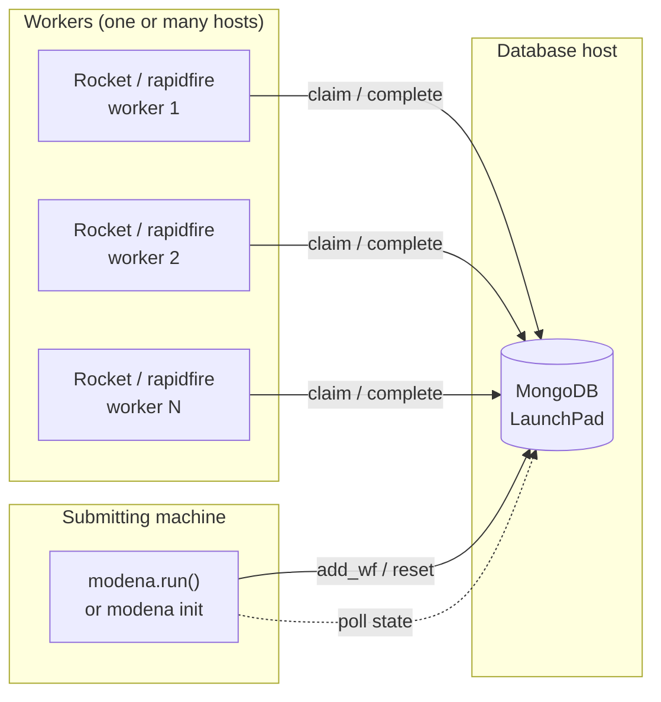
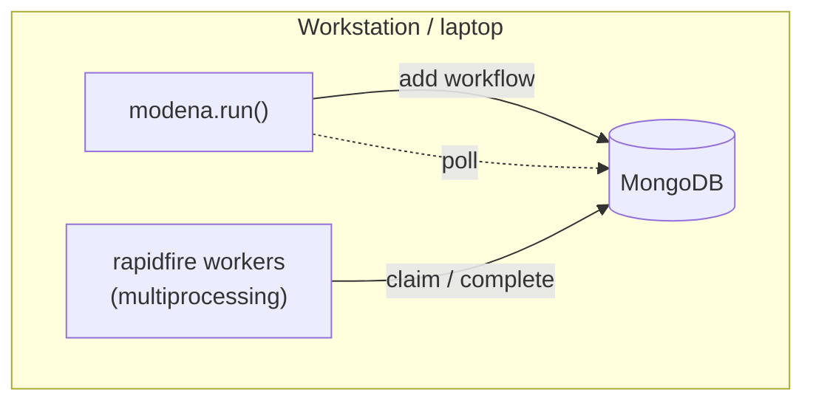
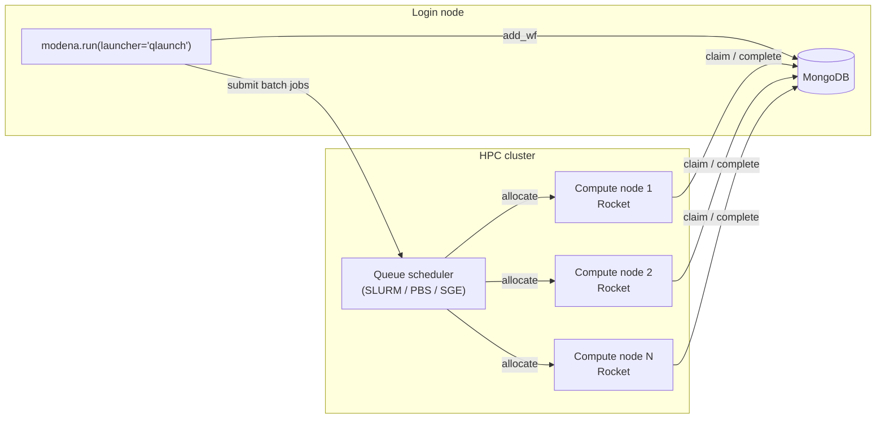
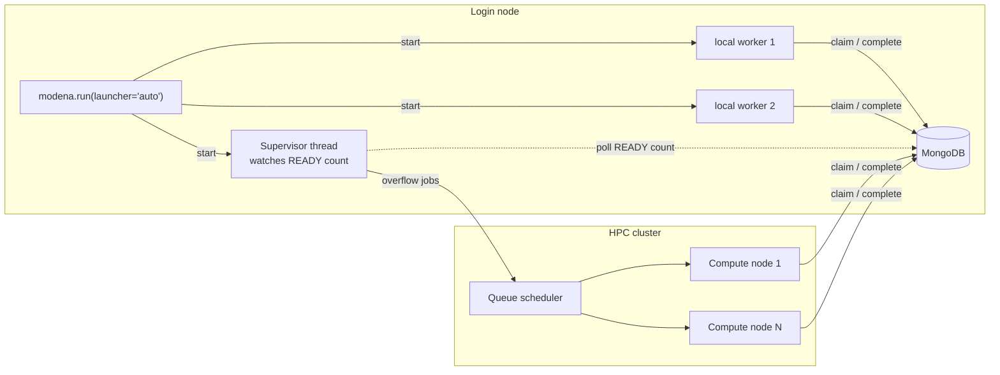
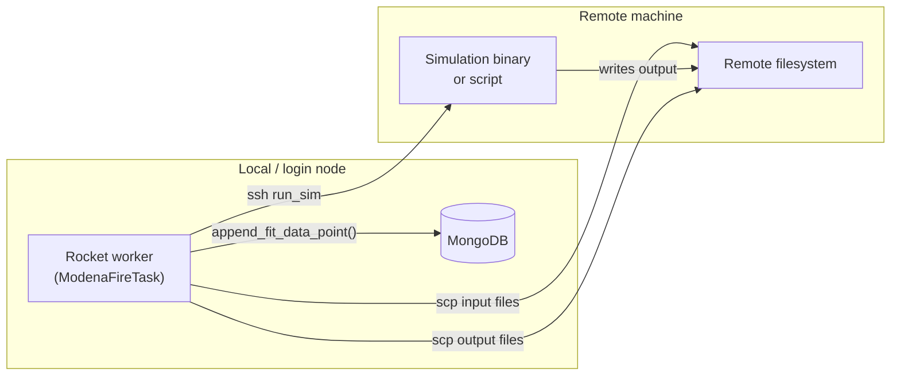
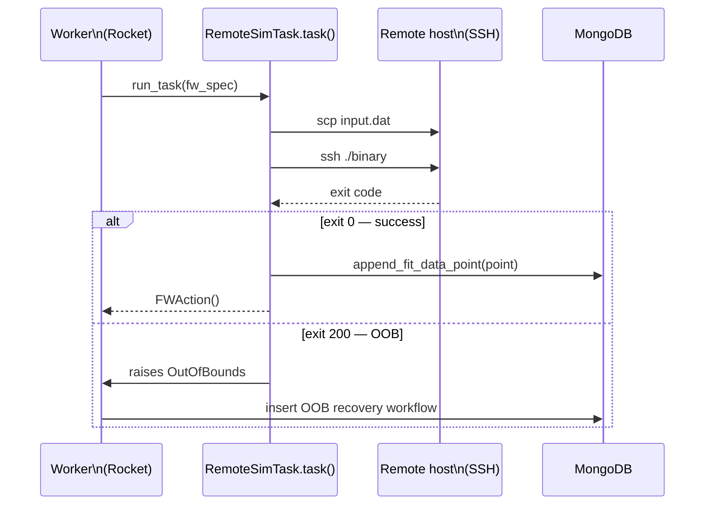
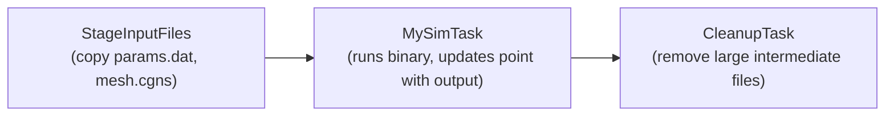

# Quick start — distributed and HPC compute

This guide covers running MoDeNa on systems where compute nodes, the MongoDB
database, and the submitting machine are on different hosts.  It also shows
how to write customised task chains (file staging, pre-processing,
post-processing) around the standard simulation Firework.

---

## Contents

1. [Topology overview](#topology-overview)
2. [Deployment topologies](#deployment-topologies)
   - [Single-node local](#topology-1-single-node-local)
   - [Login node + HPC cluster](#topology-2-login-node--hpc-cluster)
   - [Heterogeneous: local burst + HPC overflow](#topology-3-heterogeneous-local-burst--hpc-overflow)
   - [Remote desktop / workstation simulation](#topology-4-remote-desktop--workstation-simulation)
3. [Configuration files](#configuration-files)
4. [Launcher reference](#launcher-reference)
5. [Customised task chains](#customised-task-chains)
   - [File staging before a simulation](#file-staging-before-a-simulation)
   - [Post-processing after a simulation](#post-processing-after-a-simulation)
   - [Remote simulation via SSH](#remote-simulation-via-ssh)
   - [Combining pre, sim, and post in one chain](#combining-pre-sim-and-post-in-one-chain)
6. [Overriding `exactTasks()` for custom workflows](#overriding-exacttasks-for-custom-workflows)
7. [Common pitfalls](#common-pitfalls)

---

## Topology overview

Three independent services must be able to reach each other:

| Service | Runs on | Communicates with |
|---|---|---|
| **MongoDB** (LaunchPad) | any reachable host | all workers, submitter |
| **Submitter** (`modena.run`) | login node / workstation | MongoDB only |
| **Workers** (Rockets) | compute nodes | MongoDB only |

Workers **never** talk to the submitter and **never** talk to each other.
All coordination happens through MongoDB.  This means you can mix workers
from different machines, queues, and hardware architectures in the same
workflow — each just needs a route to MongoDB.



---

## Deployment topologies

### Topology 1 — single-node local

All three services on the same machine.  This is the default when you run
`./initModels` and `./workflow` from an example directory.



**`modena.toml` — nothing extra needed.**  MongoDB runs on `localhost`.

**`modena.run()` call:**

```python
modena.run(models)                  # njobs = cpu_count, launcher = 'rapidfire'
modena.run(models, njobs=1)         # sequential (useful for debugging)
```

---

### Topology 2 — login node + HPC cluster

MongoDB runs on the login node (or a dedicated database host reachable from
compute nodes).  The submitter is a Python script on the login node.  Compute
nodes run Rockets via the batch queue.



**Required files:**

```
my_project/
├── FW_config.yaml        # MongoDB URI, ADD_USER_PACKAGES
├── my_fworker.yaml       # which Fireworks this worker accepts
└── my_qadapter.yaml      # SLURM/PBS job template
```

**`FW_config.yaml`** (on both login and compute nodes, or on a shared
filesystem):

```yaml
LAUNCHPAD_LOC: /shared/path/my_launchpad.yaml   # optional
FWORKER_LOC:   /shared/path/my_fworker.yaml
QUEUEADAPTER_LOC: /shared/path/my_qadapter.yaml
ADD_USER_PACKAGES:
    - modena
```

**`my_fworker.yaml`** — default accepts everything:

```yaml
name: cluster_worker
category: ''
query: '{}'
```

Use `category` to route specific Fireworks to specific queues (see
[Common pitfalls](#common-pitfalls)).

**`my_qadapter.yaml`** (SLURM example):

```yaml
_fw_name: CommonAdapter
_fw_q_type: SLURM
rocket_launch: rlaunch -w /shared/path/my_fworker.yaml singleshot
nodes: 1
ntasks_per_node: 32
walltime: '04:00:00'
queue: compute
account: myproject
logdir: /scratch/fw_logs
pre_rocket: |
    module load modena
    export MODENA_URI=mongodb://dbhost:27017/modena
```

**`modena.run()` call:**

```python
modena.run(
    models,
    launcher='qlaunch',
    qadapter='my_qadapter.yaml',
    fworker='my_fworker.yaml',
    launch_dir='/scratch/launches',
    njobs=0,        # 0 = submit as many as needed (no cap)
)
```

---

### Topology 3 — heterogeneous: local burst + HPC overflow

Local workers handle a steady trickle of Fireworks; a supervisor thread
submits to the HPC queue when the READY count exceeds a threshold.  This is
the right choice when a macroscopic simulation sporadically generates large
bursts of out-of-bounds exact simulation tasks.



**`modena.run()` call:**

```python
modena.run(
    models,
    launcher='auto',
    njobs=4,             # 4 local workers
    escalate_at=8,       # submit to HPC when > 8 READY
    qadapter='my_qadapter.yaml',
    launch_dir='/scratch/launches',
)
```

`escalate_at=8` means up to 8 tasks run locally; any excess spills to the
cluster.  Set `escalate_at=0` to escalate immediately for any overflow beyond
the local worker count.

---

### Topology 4 — remote desktop / workstation simulation

The simulation binary lives on a remote machine (a Windows workstation, a
GPU server, a remote lab instrument).  The MoDeNa worker runs locally or on
a login node and drives the remote machine over SSH.



See [Remote simulation via SSH](#remote-simulation-via-ssh) for the
implementation pattern.

---

## Configuration files

### `MODENA_URI`

All processes must be able to reach the same MongoDB instance.  Set the URI
in `modena.toml` or as an environment variable:

```toml
# modena.toml
[database]
uri = "mongodb://dbhost:27017/modena"
```

```bash
# or via environment (overrides modena.toml)
export MODENA_URI=mongodb://dbhost:27017/modena
```

On compute nodes that cannot reach the login node's MongoDB directly, use an
SSH tunnel or a dedicated database host on the cluster network.

### `FW_config.yaml`

FireWorks reads this file from the current working directory or from
`$FW_CONFIG_FILE`.  Minimum content for a worker node:

```yaml
ADD_USER_PACKAGES:
    - modena
```

`modena` auto-imports all registered model packages, so you do not need to
list them individually.

---

## Launcher reference

| `launcher=` | Workers | HPC | Use when |
|---|---|---|---|
| `'rapidfire'` | local multiprocessing | no | laptop, single workstation |
| `'qlaunch'` | HPC queue only | yes | all work on cluster |
| `'auto'` | local + HPC overflow | yes | macroscopic sim local, exact sims on cluster |

```python
# Local only — 8 parallel workers
modena.run(models, njobs=8)

# HPC only — submit to SLURM, no local workers
modena.run(models, launcher='qlaunch', qadapter='qadapter.yaml')

# Auto — 2 local workers, HPC overflow above 4 READY tasks
modena.run(models, launcher='auto', njobs=2, escalate_at=4,
           qadapter='qadapter.yaml')
```

---

## Customised task chains

A FireWorks `Firework` can contain multiple `FireTaskBase` instances that run
in sequence.  This lets you attach file-staging, pre-processing, and
post-processing steps to the same Firework without writing custom workflow
construction code.

### File staging before a simulation

Pack the staging step and the simulation into one Firework so they run on the
same compute node and share the same working directory.

```python
from fireworks import FiretaskBase, FWAction, explicit_serialize

@explicit_serialize
class StageInputFiles(FiretaskBase):
    """Copy input files into the launch directory before the simulation."""

    required_params = ['files']   # list of local paths to copy

    def run_task(self, fw_spec):
        import shutil, pathlib
        for src in self['files']:
            dst = pathlib.Path(src).name
            shutil.copy2(src, dst)
            # or: subprocess.run(['scp', src, f'node:/scratch/{dst}'], check=True)
        return FWAction()
```

Attach it as the first task in the `exactTasks` Firework by overriding
`exactTasks()` in your model subclass (see
[Overriding `exactTasks()`](#overriding-exacttasks-for-custom-workflows)), or
pair it with the simulation task directly:

```python
from fireworks import Firework, Workflow
from modena.Strategy import ModenaFireTask

fw = Firework(
    [StageInputFiles(files=['params.dat', 'mesh.cgns']),
     MySimTask(modelId='myModel', point={...})],
    name='myModel — sim with staging',
)
```

Both tasks share the same `fw_spec` and the same launch directory.

---

### Post-processing after a simulation

```python
@explicit_serialize
class ExtractOutput(FiretaskBase):
    """Parse a result file and store the scalar output in fw_spec."""

    required_params = ['output_file', 'key']

    def run_task(self, fw_spec):
        import re
        text = open(self['output_file']).read()
        value = float(re.search(r'result\s*=\s*([\d.eE+-]+)', text).group(1))
        # Store so a downstream task or update_spec consumer can read it
        return FWAction(update_spec={self['key']: value})
```

Chain it after the simulation task in the same Firework:

```python
fw = Firework(
    [MySimTask(...),
     ExtractOutput(output_file='result.out', key='temperature')],
)
```

`update_spec` propagates `temperature` into the spec of all child Fireworks
— useful if a downstream fitting task needs it.

---

### Remote simulation via SSH

Override `task()` in a `BackwardMappingScriptTask` subclass.  The OOB
exit-code handling (`handleReturnCode`) and all MoDeNa callbacks remain intact
because they live in `run_task()`, which calls `task()` via
`executeAndCatchExceptions`.

```python
import subprocess, logging
from modena.Strategy import BackwardMappingScriptTask

class RemoteSimTask(BackwardMappingScriptTask):
    """Run a simulation on a remote host over SSH."""

    _fw_name = '{{mypackage.RemoteSimTask}}'
    optional_params = None

    required_params = ['remote_host', 'remote_workdir', 'binary']

    def task(self, fw_spec):
        host = self['remote_host']
        wdir = self['remote_workdir']
        binary = self['binary']

        # 1. Copy input file(s) to the remote working directory
        subprocess.run(
            ['scp', 'input.dat', f'{host}:{wdir}/'],
            check=True,
        )

        # 2. Run the simulation remotely, capture exit code
        result = subprocess.run(
            ['ssh', host,
             f'cd {wdir} && {binary} input.dat'],
        )
        # Delegate exit-code interpretation to MoDeNa
        # (200 = OOB, 202 = not initialised, etc.)
        self.handleReturnCode(result.returncode)

        # 3. Fetch result
        subprocess.run(
            ['scp', f'{host}:{wdir}/output.dat', '.'],
            check=True,
        )
```

The `self.handleReturnCode(result.returncode)` call is the key: it raises
`OutOfBounds`, `ParametersNotValid`, or `TerminateWorkflow` as appropriate,
which are caught by `executeAndCatchExceptions` in the parent `run_task()` and
converted to the correct `FWAction`.



---

### Combining pre, sim, and post in one chain

A three-task Firework that stages inputs, runs the simulation, and parses
outputs — all on the same node, all within a single Rocket:



```python
fw = Firework(
    [
        StageInputFiles(files=['params.dat', 'mesh.cgns']),
        MySimTask(modelId='myModel', point=p),
        CleanupTask(patterns=['*.tmp', 'core.*']),
    ],
    name=f'myModel — sim {i+1}/{n}',
)
```

`MySimTask` is a `ModenaFireTask` subclass.  When it succeeds it calls
`append_fit_data_point()` and returns `FWAction()`.  If it raises
`OutOfBounds`, FireWorks stops executing the remaining tasks in this Firework
(the `CleanupTask` is skipped) and inserts the OOB recovery workflow.  If
cleanup is critical even on failure, put it in a separate downstream Firework
that uses `_allow_fizzled_parents: true` in its spec.

---

## Overriding `exactTasks()` for custom workflows

`BackwardMappingModel.exactTasks(points)` builds the parallel simulation
Fireworks.  Override it to inject staging or post-processing tasks into every
simulation Firework without changing `Strategy.py`:

```python
from copy import deepcopy
from fireworks import Firework, Workflow
from fireworks.utilities.fw_serializers import load_object

class MyStagedModel(BackwardMappingModel):

    def exactTasks(self, points):
        """Wrap every simulation Firework with a staging step."""
        nPoints = set(map(len, points.values()))
        assert len(nPoints) == 1
        n = nPoints.pop()

        et = load_object(self.meth_exactTask)
        fws = []
        for i in range(n):
            t = deepcopy(et)
            t['point']   = {k: points[k][i] for k in points}
            t['indices'] = self.___indices___
            t['modelId'] = self._id
            fw = Firework(
                [
                    StageInputFiles(files=['shared_mesh.cgns']),
                    t,
                ],
                name=f'{self._id} — sim {i+1}/{n}',
            )
            fws.append(fw)

        return Workflow(fws, name=f'{self._id} — exact simulations')
```

---

## Common pitfalls

### Workers cannot reach MongoDB

Compute nodes on many HPC clusters are on a private network that cannot reach
external hosts.  Solutions:

- **SSH tunnel**: `ssh -L 27017:localhost:27017 login_node` from the compute
  node (set up in the `pre_rocket` block of `qadapter.yaml`).
- **Dedicated database host** on the cluster network.
- **MongoDB Atlas** with a cluster-reachable IP whitelist.

### Workers fail immediately — `ModuleNotFoundError: No module named 'modena'`

The Python environment on compute nodes must have `modena` installed.  Either:

- Use a shared filesystem installation (`CMAKE_INSTALL_PREFIX` pointing to a
  shared path).
- Add `module load modena` (or equivalent) to `pre_rocket` in
  `qadapter.yaml`.
- Build a container image with modena pre-installed and use Singularity/
  Apptainer.

### Tasks routed to wrong queue

Use FireWorks categories to separate fast fitting tasks (run locally or on
short-queue nodes) from expensive exact simulations (run on large-memory nodes):

```python
# Simulation Firework — goes to the 'bigmem' queue
fw_sim = Firework(MySimTask(...), spec={'_category': 'bigmem'})

# Fitting Firework — stays local
fw_fit = Firework(ParameterFitting(...), spec={'_category': 'local'})
```

```yaml
# my_fworker.yaml — one per queue type
name: bigmem_worker
category: bigmem
```

```python
modena.run(models, fworker='bigmem_fworker.yaml', launcher='qlaunch',
           qadapter='bigmem_qadapter.yaml')
```

### Simulation exits before writing output

If the remote machine or compute node is killed before `scp` fetches the
output, the Firework FIZZLES.  The `nonConvergenceStrategy` on the model
controls recovery:

```python
m = BackwardMappingModel(
    ...
    nonConvergenceStrategy=FizzleOnFailure(),   # strict: stop the workflow
    # nonConvergenceStrategy=SkipPoint(),       # lenient: skip this point
)
```

### `DocumentTooLarge` in long-running workflows

Simulation results must never be stored in FireWorks Firework documents.
MoDeNa writes each result directly to MongoDB via `append_fit_data_point()`
(an atomic `$push`) so Firework specs stay small regardless of how many
OOB recovery cycles occur.  Do not use `FWAction(mod_spec=[{'_push': ...}])`
to accumulate simulation data — this was the old pattern and will hit the
16 MB MongoDB document limit after enough cycles.
